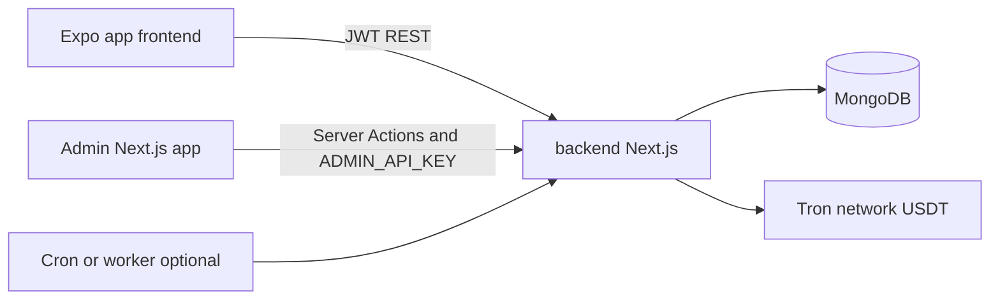
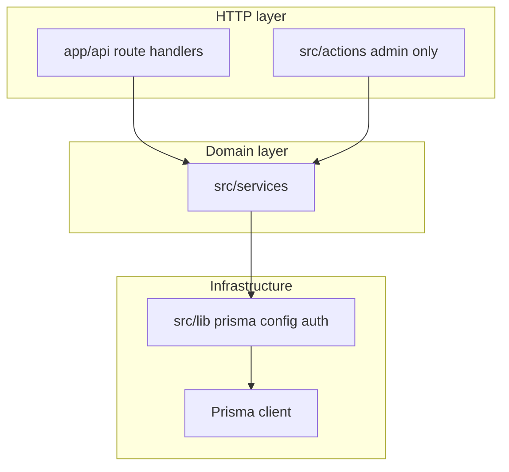

# Backend architecture (Next.js)

Production API for IndieFundr, migrated from Express ([`backend-legacy/`](../backend-legacy/)) to **Next.js 16** App Router. The Expo app talks to this server over REST; a separate admin Next.js app will use Server Actions and/or admin API routes.

---

## System context

| Component | Location | Notes |
|-----------|----------|--------|
| User mobile/web | [`frontend/`](../frontend/) | Unchanged during API migration |
| User + admin API | `backend/` (this app) | Next.js |
| Legacy reference | [`backend-legacy/`](../backend-legacy/) | Frozen during migration; decommission after cutover |
| Revenue engine spec | [`specs/revenue-engine/README.md`](specs/revenue-engine/README.md) | Triad math, unlock rules, ledger |

---

## Layered design

### Route handlers (`app/api/`)

- One file per HTTP method and path segment (Next convention: `route.ts`).
- Responsibilities: CORS if needed, auth guard, parse JSON, call service, map errors to status codes.
- **Expo-facing:** all routes under `/api/*` that exist in legacy today.

### Services (`src/services/`)

Port of legacy modules, including:

| Service | Legacy source | Role |
|---------|---------------|------|
| `auth/` | `authTokens.js`, user OTP controllers | Passwordless login, refresh sessions |
| `tron/` | `tronClient.js` | TronWeb USDT transfers, tx status |
| `purchaseOrder/` | `purchaseOrderProcessor.js` | Subscribe pipeline, fee sponsorship |
| `investment/` | `investmentMaturity.js`, portfolio | Maturity, portfolio breakdown |
| `revenueEngine/` | `services/revenueEngine/` | Queue, ledger, payability |
| `mailing/` | `mailing-service.js` | Resend + React Email OTP |

### Library (`src/lib/`)

- **`prisma.ts`** — singleton Prisma client (dev hot-reload safe).
- **`env.ts`** — Zod-validated environment variables.
- **`config/`** — pricing, fund catalog, revenue constants (from legacy `config/`).
- **`config/investmentTiming.ts`** — investment term length (`maturesAt` at subscribe); see [CONVENTIONS.md](CONVENTIONS.md#investment-timing).
- **`auth/`** — JWT verification, admin API key verification.

### Server Actions (`src/actions/`)

- **Admin panel only** — pages under [`src/app/admin/`](src/app/admin/) (`/admin/login`, `/admin/dashboard`, `/admin/users`, `/admin/investments`, `/admin/treasury`).
- Signed httpOnly `admin_session` cookie after email OTP (`ADMIN_ALLOWED_EMAIL` + Resend); actions call the same services as REST admin routes.
- **Never imported by the Expo app** ([`frontend/`](../frontend/)); mobile uses REST only.

---

## Data layer

**Prisma** with MongoDB provider (same Atlas cluster as legacy).

Models ported from Mongoose (see [`plan/steps/step-01-prisma-schema.md`](plan/steps/step-01-prisma-schema.md)):

- Users, auth (`User`, `RefreshSession`, `OtpVerification`)
- Wallets, investments, purchase orders
- Treasury ledger (`TreasuryLedger`, `TreasuryEvent`, `AppRevenueWithdrawal`)
- Optional: `Profile`, `Photo` (low priority — unused by Expo today)

---

## Background processing

Legacy runs a **minute cron** in one Node process:

1. Process pending purchase orders (Tron USDT subscribe)
2. Mark investments matured
3. Revenue engine `evaluateAll`
4. Confirm redemptions on-chain

In production on **Vercel**, use **Vercel Cron** → secured `src/app/api/cron/...` route (see [step 09](plan/steps/step-09-background-jobs.md)). Set `maxDuration` in `next.config.ts` and keep each tick bounded (batch purchase orders; avoid long Tron waits in one invocation). Use a **separate worker** only if serverless timeouts are exceeded.

---

## Realtime (HTTP polling)

Legacy used **Socket.io** (`global.io`). **Vercel serverless does not support Socket.io** on the default Next.js deployment — no persistent WebSocket server.

Expo uses **HTTP polling** instead (see `frontend/hooks/usePolling.ts`).

| Need | Poll endpoint |
|------|----------------|
| Active subscribe order | `GET /api/funds/orders/current?fundId=` |
| Order detail | `GET /api/funds/orders/:orderId` |
| Portfolio / payability | `GET /api/investments` |

**Interval:** 2–3 seconds (default 2500 ms).

**Start polling when:**

- Purchase order `status` is `queued` or `processing` (subscribe flow, funds list)
- Investment `status` is `redeeming` (portfolio claim in progress)
- Optional: portfolio holdings with `payabilityStatus` `pending_liquidity` while waiting for payout liquidity

**Stop polling when:**

- Order reaches terminal status: `completed` or `failed`
- Investment reaches `redeemed` or returns to `active`/`matured` after a failed redemption broadcast
- Screen unmounts or route loses focus
- App moves to **background** (`AppState` not `active`) — resume on foreground

**Auth:** All poll requests use the same `x-auth-token` header as other authenticated API calls.

Order poll responses include `orderId`, `status`, `step`, `failureReason`, `investmentId`, and on-chain tx ids (`topUpTxId`, `usdtTxId`) via `formatOrderResponse` in `src/services/funds/orders.ts`.

---

## Admin boundary

| Surface | Auth | Purpose |
|---------|------|---------|
| `/api/admin/treasury/*` | `ADMIN_API_KEY` header | JSON for external admin apps |
| `src/actions/*` | `admin_session` cookie (OTP for `ADMIN_ALLOWED_EMAIL` only) | In-repo admin UI at `/admin/*` |

Treasury math lives only in `src/services/revenueEngine/`. See legacy [Admin API docs](../backend-legacy/docs/BACKEND_ARCHITECTURE.md#admin-api-separate-nextjs-app).

---

## Deployment notes

- **Frontend (Expo):** may use Vercel/static hosting; set `API_URL` to this backend.
- **This backend:** Node 20+ on Vercel; serverless function timeouts apply — design cron and Tron work in bounded batches; use polling instead of Socket.io.
- **Secrets:** treasury private key, JWT secrets, Resend, Tron API key — server env only.

---

## Related documents

- [CONVENTIONS.md](CONVENTIONS.md) — naming and folder rules
- [plan/README.md](plan/README.md) — incremental migration steps
