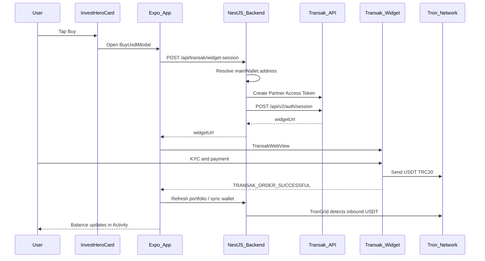

# Transak USDT (TRC-20) integration guide

This document is the integration playbook for adding a **Buy USDT** flow to IndieFundr via [Transak](https://docs.transak.com/getting-started/what-is-transak). It covers partner onboarding, backend session creation, mobile widget UX, deposit reconciliation, testing, and rollout.

**Status:** Implemented (staging). Backend creates secure widget sessions; frontend **Buy** button opens Transak via `@transak/ui-expo-sdk`.

**Related IndieFundr code today:**

| Area | Path |
|------|------|
| Home hero + action buttons (Add Funds, Buy, Invest, Withdraw) | `frontend/components/wallet/InvestHeroCard.tsx` |
| Manual deposit (copy address) | `frontend/components/wallet/AddFundsModal.tsx` |
| USDT / TRC-20 labels | `frontend/constants/Strings.ts` |
| Wallet generation | `backend/src/services/wallets/ensureDefaultWallet.ts` |
| Inbound USDT detection | `backend/src/services/wallets/walletSyncService.ts` |
| Activity feed | `backend/src/services/wallets/walletActivityMaterializer.ts` |
| Available balance | `backend/src/services/wallets/walletBalance.ts` |

---

## 1. Network support verdict

**Yes — Transak supports USDT on the Tron network (TRC-20).**

Evidence:

- [Supported stablecoins](https://transak.com/crypto-coverage/stable-coins) includes USDT on multiple networks, including Tron.
- [Sell USDT](https://transak.com/sell/usdt) documents selecting **Tron** as the network for USDT.
- Transak widget configuration uses `cryptoCurrencyCode: "USDT"` and `network: "tron"` in `widgetParams` ([Query parameters](https://docs.transak.com/customization/query-parameters)).

### Mandatory verification before production

Call the public [Get Crypto Currencies API](https://docs.transak.com/api/public/get-crypto-currencies) and confirm that **USDT + `tron`** is enabled for **BUY** in your partner account, target user countries, and fiat currencies. Availability varies by:

- User country / region
- Payment method (Apple Pay, card, bank transfer, etc.)
- KYB approval status
- Partner portal product settings

Example (no auth required):

```bash
curl "https://api-gateway-stg.transak.com/api/v1/currencies/crypto-currencies"
```

Inspect the response for `USDT` entries where `network.name` (or equivalent) includes Tron.

### IndieFundr constraints

- Custodial wallets are **Tron TRC-20 USDT** (mainnet in production, Shasta on testnet via `BLOCKCHAIN_NETWORK`).
- Transak must deliver purchased USDT to the user’s **`mainWallet.address`** on network **`tron`**.
- Transak **staging** uses sandbox flows; confirm whether staging settles on Shasta testnet or uses mocked settlement — align with backend `BLOCKCHAIN_NETWORK` before relying on end-to-end balance updates.
- Payment methods are **country-dependent**. Do not hard-code a single global `paymentMethod` without lookup API checks.

---

## 2. Goals and UX

### Product goals

1. Let users **without crypto knowledge** buy USDT with familiar payment methods (Apple Pay, debit/credit card, and other methods Transak supports in their country).
2. Deliver USDT directly into the user’s existing IndieFundr custodial wallet — no external wallet setup.
3. Keep the experience **very simple**: one **Buy** button on Home, Transak handles KYC and checkout inside an embedded widget.

### Home screen UX (v1)

Today, `InvestHeroCard` exposes three actions:

| Button | Purpose |
|--------|---------|
| Add Funds | Manual deposit — show wallet address to copy/share |
| Invest | Navigate to investment funds |
| Withdraw | Open withdraw modal |

**Planned addition:** a fourth **Buy** button that opens a Transak widget modal.

- **Buy** — fiat → USDT via Transak (new)
- **Add Funds** — keep for users who already hold USDT elsewhere

Gate **Buy** with the same `walletPreparing` check used for Invest/Withdraw (wallet must be ready to receive deposits).

Suggested copy:

- Button label: **Buy**
- Modal title: **Buy USDT**
- Subtitle: *Pay with card or Apple Pay. USDT is sent to your IndieFundr wallet on Tron (TRC-20).*
- Reuse the network-warning tone from `AddFundsModal` (`getDepositNetworkHeadline()`, `getDepositWarningMessage()` in `frontend/constants/Strings.ts`).

---

## 3. Recommended integration approach

Use **Transak Widget + React Native SDK** — not the full Whitelabel API — for v1.

| Approach | Complexity | Fit for simple “Buy” button |
|----------|------------|---------------------------|
| **Widget + RN SDK (recommended)** | Low | Tap Buy → modal WebView → Transak handles KYC, payment, delivery |
| Whitelabel API | High | Custom UI for every KYC/payment screen |
| Redirect to hosted URL | Medium | Leaves app context on mobile |

Docs: [React Native integration](https://docs.transak.com/integration/mobile/react-native)

### End-to-end flow



### Security model (non-negotiable)

Transak requires the [**Create Widget URL API**](https://docs.transak.com/guides/migration-to-api-based-transak-widget-url) on the **backend**. Passing query parameters directly in a client-side widget URL is **deprecated**.

- **API Secret** and **Partner Access Token** — server only (`backend/.env`), never in Expo or git.
- **API Key** — may appear in `widgetParams` server-side; still prefer backend-only session creation.
- Each `widgetUrl` is valid for **~5 minutes** and **single-use**. Generate a new session for every Buy flow.

---

## 4. Partner onboarding checklist

Complete these before writing production code.

| Step | Action | Reference |
|------|--------|-----------|
| 1 | Sign up at [Partner Dashboard](https://dashboard.transak.com) with a corporate email | [Create partner account](https://docs.transak.com/guides/how-to-create-partner-dashboard-account) |
| 2 | Copy **staging** API Key + API Secret (Developers tab) | Available immediately |
| 3 | Submit [KYB](https://forms.transak.com/kyb) with the same email | Required for **production** API key |
| 4 | Enable **BUY** in partner portal; confirm USDT / Tron for target regions | Partner dashboard |
| 5 | Register **referrerDomain** and mobile app identifiers | Required in `widgetParams` |
| 6 | Request webhook URL registration (HTTPS, post-KYB for production) | [Webhooks](https://docs.transak.com/features/webhooks) |
| 7 | Review sandbox test cards and KYC flows | [Widget URL testing guide](https://docs.transak.com/guides/how-to-create-a-widget-url-and-test-different-scenarios) |

### Environment URLs

| Environment | API gateway | Widget host |
|-------------|-------------|-------------|
| Staging | `https://api-gateway-stg.transak.com` | `https://global-stg.transak.com` |
| Production | `https://api-gateway.transak.com` | `https://global.transak.com` |

---

## 5. Backend configuration (planned)

Add to `backend/src/lib/env.ts` and `backend/.env.example`:

| Variable | Purpose |
|----------|---------|
| `TRANSAK_API_KEY` | Partner API key (staging or production) |
| `TRANSAK_API_SECRET` | Partner API secret — **never expose to client** |
| `TRANSAK_ENV` | `staging` \| `production` — selects gateway base URL |
| `TRANSAK_REFERRER_DOMAIN` | Approved domain (e.g. `indiefundr.com`) for `widgetParams.referrerDomain` |

Webhook JWT verification uses the Partner Access Token per [How to decrypt webhook payload](https://docs.transak.com/guides/how-to-decrypt-webhook-payload.mdx).

Example `.env.example` entries:

```env
TRANSAK_ENV=staging
TRANSAK_API_KEY=
TRANSAK_API_SECRET=
TRANSAK_REFERRER_DOMAIN=indiefundr.com
```

---

## 6. Backend implementation plan

### 6.1 `POST /api/transak/widget-session` (authenticated)

New route: `backend/src/app/api/transak/widget-session/route.ts` (path name TBD).

**Steps:**

1. Authenticate user (same pattern as other `/api/wallets/*` routes).
2. Ensure wallet exists — call `ensureUserHasWallet` / load `mainWallet` from portfolio (`ensureDefaultWallet.ts`).
3. If no `mainWallet.address`, return `503` or trigger wallet creation and retry.
4. Create a short-lived [Partner Access Token](https://docs.transak.com) using API key + secret.
5. `POST {gateway}/api/v2/auth/session` with `access-token` header and body:

```json
{
  "widgetParams": {
    "apiKey": "<TRANSAK_API_KEY>",
    "referrerDomain": "<TRANSAK_REFERRER_DOMAIN>",
    "productsAvailed": "BUY",
    "cryptoCurrencyCode": "USDT",
    "network": "tron",
    "walletAddress": "<mainWallet.address>",
    "disableWalletAddressForm": true,
    "partnerCustomerId": "<userId>",
    "email": "<user.email>"
  }
}
```

6. Return `{ widgetUrl }` from the Transak response to the client.

**Example curl (staging, for manual testing):**

```bash
# 1. Create partner access token (see Transak docs for exact endpoint)
# 2. Create widget session
curl --request POST \
  --url https://api-gateway-stg.transak.com/api/v2/auth/session \
  --header 'accept: application/json' \
  --header 'access-token: YOUR_PARTNER_ACCESS_TOKEN' \
  --header 'content-type: application/json' \
  --data '{
    "widgetParams": {
      "apiKey": "YOUR_STAGING_API_KEY",
      "referrerDomain": "indiefundr.com",
      "productsAvailed": "BUY",
      "cryptoCurrencyCode": "USDT",
      "network": "tron",
      "walletAddress": "TXkxquoeMXADC55j2it1esaNUxj3xapScP",
      "disableWalletAddressForm": true
    }
  }'
```

Suggested service module: `backend/src/services/transak/createWidgetSession.ts`

### 6.2 `POST /api/transak/webhook` (optional, phase 3)

- Public HTTPS endpoint for Transak order lifecycle events.
- Verify JWT in the `data` field using Partner Access Token ([webhook decryption guide](https://docs.transak.com/guides/how-to-decrypt-webhook-payload.mdx)).
- On completed orders: optionally call `syncWallet` for the user’s main wallet.
- Persist order records for admin/support (new Prisma model or external logging).

Primary balance updates can still rely on existing TronGrid deposit detection — webhooks improve timeliness and support visibility.

### 6.3 `GET /api/transak/quote` (optional, v2)

Proxy Transak public **Get Price** API so the app can show an estimated USDT amount before opening the widget. Not required for v1.

---

## 7. Frontend implementation plan

### 7.1 Dependencies

```bash
cd frontend
npx expo install @transak/ui-expo-sdk react-native-webview @react-native-community/netinfo
```

Docs: [React Native SDK](https://docs.transak.com/integration/mobile/react-native) | [Expo SDK on npm](https://www.npmjs.com/package/@transak/ui-expo-sdk)

Expo may require camera permissions for Transak KYC — follow SDK setup notes for Expo vs bare workflow.

### 7.2 UI changes

| File | Change |
|------|--------|
| `frontend/components/wallet/InvestHeroCard.tsx` | Add 4th `HeroAction`: label **Buy**, opens buy modal |
| `frontend/components/wallet/BuyUsdtModal.tsx` | **New** — modal shell + `TransakWebView` |
| `frontend/redux/actions/transakActions.js` | **New** — `createTransakWidgetSession()` calling backend |
| `frontend/constants/Strings.ts` | Optional buy-flow copy helpers |

### 7.3 Client flow

```typescript
import {
  TransakWebView,
  Events,
  type TransakConfig,
  type OnTransakEvent,
} from '@transak/ui-expo-sdk';

const transakConfig: TransakConfig = {
  widgetUrl: session.widgetUrl, // from POST /api/transak/widget-session
  referrer: 'https://indiefundr.com', // must be a valid URL per SDK
};

const onTransakEvent: OnTransakEvent = (event, data) => {
  switch (event) {
    case Events.TRANSAK_ORDER_SUCCESSFUL:
      // Close modal, refreshInvestScreen({ force: true }), show toast
      break;
    case Events.TRANSAK_ORDER_FAILED:
    case Events.TRANSAK_ORDER_CANCELLED:
    case Events.TRANSAK_WIDGET_CLOSE:
      // Close modal gracefully
      break;
    default:
      break;
  }
};

// <TransakWebView transakConfig={transakConfig} onTransakEvent={onTransakEvent} />
```

Post-success message suggestion: *“Purchase complete. USDT may take a few minutes to appear in your balance.”*

Trigger the same portfolio refresh used on Home pull-to-refresh (`refreshInvestScreen` in `frontend/redux/actions/walletActions.js`).

### 7.4 Web (Expo web)

The RN SDK targets iOS/Android. For web, use Transak’s [Web Embed / iframe integration](https://docs.transak.com) with the same backend `widgetUrl`. Consider `Platform.OS === 'web'` branching in `BuyUsdtModal`.

---

## 8. UX simplicity guidelines (v1)

### Lock in `widgetParams` (user cannot change)

| Parameter | Value | Why |
|-----------|-------|-----|
| `productsAvailed` | `BUY` | On-ramp only |
| `cryptoCurrencyCode` | `USDT` | App currency |
| `network` | `tron` | TRC-20 custodial wallet |
| `walletAddress` | `mainWallet.address` | Auto-credit user wallet |
| `disableWalletAddressForm` | `true` | Prevent wrong-address mistakes |
| `email` | user email | Faster KYC if available |
| `partnerCustomerId` | user id | Support + webhook correlation |

### Leave unset in v1 (Transak widget handles)

| Parameter | Reason |
|-----------|--------|
| `paymentMethod` | Apple Pay, cards, and local methods vary by country |
| `fiatAmount` / `fiatCurrency` | User picks amount in widget unless you add an in-app amount step later |
| `hideExchangeScreen` | Keep `false` initially to avoid validation failures across regions |

### v2 enhancements (optional)

- In-app fiat amount picker → pass `fiatAmount` + `fiatCurrency` + `hideExchangeScreen: true`
- Apple Pay shortcut → `paymentMethod: "apple_pay"` when [lookup APIs](https://docs.transak.com/integration/api) confirm support for user country
- Show quote before opening widget via `GET /api/transak/quote`

---

## 9. Deposit reconciliation

**No Transak-specific blockchain code is required.** Existing IndieFundr pipeline handles inbound USDT:

1. Transak sends USDT (TRC-20) to `mainWallet.address` on Tron.
2. `syncWalletChainTransfers` in `walletSyncService.ts` fetches TRC-20 history from TronGrid.
3. `walletActivityMaterializer.ts` creates a **“USDT received”** activity row.
4. `walletBalance.ts` updates `onChainUsdt` and `availableUsdt`.

### Post-purchase client behavior

After `TRANSAK_ORDER_SUCCESSFUL`:

1. Call `refreshInvestScreen({ force: true })` or `POST /api/wallets/sync`.
2. Show `pendingInboundUsdt` hint if sync detects unconfirmed inbound (same as manual deposits).
3. Existing home activity list updates on refresh — no new list component needed.

Settlement time depends on Transak and Tron confirmation — do not promise instant balance updates.

---

## 10. Compliance, fees, and legal

- **KYC/AML** is performed by Transak inside the widget — separate from IndieFundr passwordless auth.
- **Card data** never touches IndieFundr servers — state this clearly in the Buy modal footer.
- **Fees** are shown inside the Transak widget; optional partner revenue via [partner fee configuration](https://docs.transak.com).
- **Country restrictions** — verify supported countries before marketing Buy globally ([lookup APIs](https://docs.transak.com/integration/api)).
- **App store** — disclose third-party fiat purchase flow in iOS/Android review notes.
- **Terms** — partner agreement may require Transak branding, terms links, or privacy disclosures in-app.

---

## 11. Testing plan

### Staging

1. Configure `TRANSAK_ENV=staging` and staging API credentials.
2. Implement `POST /api/transak/widget-session` and verify `widgetUrl` in response.
3. Open widget in app; complete flow with [sandbox test cards](https://docs.transak.com/guides/how-to-create-a-widget-url-and-test-different-scenarios) (e.g. Visa `4242424242424242`, expiry `10/33`, CVV `100` for GBP/EUR).
4. Confirm SDK events: `TRANSAK_WIDGET_INITIALISED`, `TRANSAK_ORDER_CREATED`, `TRANSAK_ORDER_SUCCESSFUL`.
5. Confirm wallet sync / activity shows inbound USDT (or document staging settlement behavior if testnet differs).

### Production (post-KYB)

1. Switch to production API key and gateway URL.
2. Small real purchase in a supported country.
3. Verify webhook delivery (if configured).
4. Verify balance and activity update within expected settlement window.

### Regression checks

- **Add Funds** manual flow still works unchanged.
- **Invest** / **Withdraw** unaffected.
- Buy button disabled or shows alert when `walletPreparing` is true.

---

## 12. Rollout phases

| Phase | Deliverable |
|-------|-------------|
| **0** | This document + partner dashboard account + KYB submitted |
| **1** | Backend `widget-session` endpoint, env vars, staging smoke test |
| **2** | Home **Buy** button + `BuyUsdtModal` + refresh on success |
| **3** | Webhooks + optional admin order visibility |
| **4** | Amount picker, Apple Pay shortcut, partner fees, web embed |

---

## 13. Risks and open questions

| Risk | Mitigation |
|------|------------|
| Tron staging vs mainnet mismatch | Confirm Transak staging settlement with `BLOCKCHAIN_NETWORK`; test on Shasta if applicable |
| Minimum purchase limits vary | Surface Transak widget errors; don’t hard-code minimums in app |
| `mainWallet` null on first Buy | Call `ensureUserHasWallet` before session creation; show loading state |
| Widget URL expiry (5 min) | Create session when modal opens, not on Home mount |
| Country / payment method unsupported | Lookup APIs + graceful error if session creation fails |
| iOS App Store review | Document Transak as payment processor in review notes |

**Open questions to resolve with Transak support:**

1. Does staging deliver real testnet USDT on Shasta, or simulate completion without on-chain transfer?
2. Which `referrerDomain` / bundle ID values are required for Expo iOS and Android builds?
3. Is Apple Pay available for USDT-on-Tron BUY in your target launch countries?

---

## 14. Implementation checklist

Use this when moving from documentation to code.

### Backend

- [x] Add Transak env vars to `src/lib/env.ts` and `.env.example`
- [x] `src/services/transak/partnerAccessToken.ts`
- [x] `src/services/transak/createWidgetSession.ts`
- [x] `POST /api/transak/widget-session` route with auth
- [ ] (Phase 3) `POST /api/transak/webhook` + JWT verification
- [ ] (Phase 3) Optional `TransakOrder` Prisma model

### Frontend

- [x] Install `@transak/ui-expo-sdk` (+ peer deps)
- [x] `BuyUsdtModal.tsx` with `TransakWebView`
- [x] **Buy** button in `InvestHeroCard.tsx`
- [x] `transakActions.js` — fetch widget session from backend
- [x] Success → `refreshInvestScreen({ force: true })` + alert
- [x] (Web) iframe fallback in `BuyUsdtModal`

### Ops

- [x] Partner dashboard staging credentials in local `.env` (not committed)
- [ ] KYB approved before production keys
- [ ] Webhook URL registered with Transak
- [ ] App store copy updated

---

## 15. Reference links

| Topic | URL |
|-------|-----|
| Transak docs index | https://docs.transak.com/ |
| What is Transak | https://docs.transak.com/getting-started/what-is-transak |
| Partner dashboard setup | https://docs.transak.com/guides/how-to-create-partner-dashboard-account |
| React Native SDK | https://docs.transak.com/integration/mobile/react-native |
| Create Widget URL (mandatory) | https://docs.transak.com/guides/migration-to-api-based-transak-widget-url |
| Widget URL testing | https://docs.transak.com/guides/how-to-create-a-widget-url-and-test-different-scenarios |
| Query parameters (`widgetParams`) | https://docs.transak.com/customization/query-parameters |
| Widget + API customization | https://docs.transak.com/guides/widget-with-api-customization |
| Webhooks | https://docs.transak.com/features/webhooks |
| Webhook payload decryption | https://docs.transak.com/guides/how-to-decrypt-webhook-payload.mdx |
| Get Crypto Currencies API | https://docs.transak.com/api/public/get-crypto-currencies |
| Lookup / public APIs | https://docs.transak.com/integration/api |
| USDT on Tron (product page) | https://transak.com/sell/usdt |
| RN SDK on npm | https://www.npmjs.com/package/@transak/react-native-sdk |

---

*Last updated: integration planning phase. Update this doc when endpoints ship or Transak partner settings change.*
