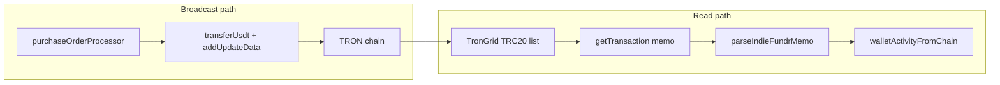

# TRON transaction memo for reconciliation

This document describes how IndieFundr can attach **opaque, public on-chain metadata** to app-initiated TRON transactions (especially USDT TRC20 transfers) and use it for wallet activity classification and reconciliation. It is a **design and implementation guide** for backend, frontend, cron jobs, database, and treasury ledger work.

**Status:** Implemented in code. `INDIEFUNDR_CHAIN_MEMO_ENABLED` defaults to **true** (set `false` to disable on-chain memo broadcast). Verify on Shasta before production rollout.

**Manual Shasta checklist (per release):**
1. Subscribe to a fund — Activity shows **one** pending `purchase-order-*` row through Preparing → Sending → Confirming.
2. On TronScan, USDT payment memo matches `INDIEFUNDR/1/invest/{fundId}/{orderId}`.
3. After confirmation, same logical row shows confirmed with TronScan link (no duplicate generic USDT out).
4. Force TRX top-up failure — UI shows **Retrying** / **Preparing**, not a separate failed USDT line or terminal Failed until cap.
5. Portfolio invested balance matches confirmed investments after poll (`home-pending`).

---

## 1. Executive summary

### What we want

When a user invests, redeems, or receives a treasury payout, the corresponding on-chain transaction should carry a small **transaction memo** so that:

- The invest screen can classify activity from the **network first** (see [`walletActivityFromChain`](../src/services/wallets/walletActivityFromChain.ts)), with less dependence on stale or incorrect DB materialization.
- Ops can correlate a TronScan transaction to a `purchaseOrderId` or `investmentId` without guessing from amount and timestamp alone.
- Cron jobs and treasury ledger logic keep using **txId + amount + addresses** as the source of truth; the memo is an **index hint**, not a substitute for accounting.

### What TRON allows

TRON supports an optional **transaction memo** in `raw_data.data` at the protocol level. This is **separate** from the smart contract `data` field used by `transfer(address,uint256)` on the USDT contract.

| Field | Layer | Custom metadata? |
|-------|--------|------------------|
| `raw_data.data` | Transaction memo | **Yes** — UTF-8 or hex string, visible on-chain |
| `TriggerSmartContract.parameter.value.data` | USDT ABI calldata | **No** — only `to` + `amount` for standard TRC20 USDT |

### What we will not put on chain

Per product and privacy requirements:

- **No** `userId`, email, name, or wallet private key
- **Only** opaque app references: `fundId`, `purchaseOrderId`, `investmentId`, and a `kind` discriminator

Memos are **public forever** on TronScan and block explorers.

### Relationship to existing systems

| System | Role after memos |
|--------|------------------|
| [`walletActivityFromChain`](../src/services/wallets/walletActivityFromChain.ts) | Primary UI read path: last N TRC20 txs + enrichment |
| [`walletSyncService`](../src/services/wallets/walletSyncService.ts) + materializer | Background sync; store memo in `WalletChainTransfer.raw` |
| [`fundPaymentReconciliation`](../src/services/wallets/fundPaymentReconciliation.ts) | Heal orders; optional memo-based `usdtTxId` repair |
| [`TreasuryEvent`](../src/prisma/schema.prisma) / ledger | Still keyed on `txId`, order/investment ids, amounts |
| Frontend | **No** memo handling; displays API `label` / `detail` only |

---

## 2. Protocol background (TRON documentation)

### Transaction memo (`raw_data.data`)

From the [TRON protocol transaction docs](https://developers.tron.network/docs/tron-protocol-transaction):

- `raw_data.data` is the **transaction memo** (hex-encoded on wire).
- It applies to **all** transaction types, including `TriggerSmartContract` (TRC20 USDT transfers).
- Memo bytes increase total transaction size and therefore **bandwidth** usage; very large memos cost more TRX if free bandwidth is exhausted.
- [TIP-387](https://github.com/tronprotocol/tips/issues/387) discusses optional network fees for non-empty memos (parameter-driven by validators). Treat memos as **potentially costing extra bandwidth/TRX** on sponsored user wallets.

### USDT transfer contract call

From [supported transaction types](https://developers.tron.network/docs/tron-contracttype): `TriggerSmartContract.data` is **ABI-encoded** function call data (`transfer` selector + arguments). You cannot add fund or user fields there without deploying a **custom** token contract.

### Reading memos from the network

- TronGrid **`/v1/accounts/{address}/transactions/trc20`** returns `transaction_id`, from, to, value — **not** the memo.
- To read a memo you must fetch the full transaction (e.g. `tronWeb.trx.getTransaction(txId)`) and decode `raw_data.data` from hex to UTF-8.
- Plan for **extra API calls** when enriching the last 30 activity rows (batch with concurrency limits and short TTL cache).

### Broadcasting with TronWeb

Current code: [`transferUsdt`](../src/services/tron/client.ts) uses `triggerSmartContract` only.

Required sequence ([TronWeb `addUpdateData`](https://tronweb.network/docu/docs/API%20List/transactionBuilder/addUpdateData)):

1. `transactionBuilder.triggerSmartContract(...)` — build unsigned USDT transfer.
2. `transactionBuilder.addUpdateData(unsignedTx, memo)` — set `raw_data.data`.
3. `tronWeb.trx.sign(updatedTx)` — sign the **new** transaction object (txID changes after step 2).
4. `tronWeb.trx.sendRawTransaction(signed)`.



---

## 3. Memo format specification

### Canonical string (UTF-8)

```
INDIEFUNDR/<version>/<kind>/<fundId>/<entityId>
```

| Segment | Description | Example |
|---------|-------------|---------|
| Prefix | Literal `INDIEFUNDR` | `INDIEFUNDR` |
| `version` | Schema version (integer string) | `1` |
| `kind` | Transaction intent | `invest`, `redeem`, `topup`, `payout` |
| `fundId` | Fund slug from config | `growth` |
| `entityId` | Mongo ObjectId string | `674a1b2c3d4e5f6789012345` |

**Example:** `INDIEFUNDR/1/invest/growth/674a1b2c3d4e5f6789012345`

### Kind values

| `kind` | Meaning | Typical `entityId` | Broadcast site |
|--------|---------|-------------------|----------------|
| `invest` | User USDT payment toward treasury for a fund purchase | `purchaseOrder.id` | [`purchaseOrderProcessor.ts`](../src/services/orders/purchaseOrderProcessor.ts) |
| `redeem` | Treasury USDT payout to user wallet | `investment.id` | [`payoutScheduler.ts`](../src/services/revenueEngine/payoutScheduler.ts) |
| `payout` | Alias for treasury→user USDT (if distinct from redeem in code) | `investment.id` | Same as redeem |
| `topup` | TRX fee sponsorship step (optional, lower priority) | `purchaseOrder.id` | Fee sponsorship / activation |

### Validation rules (implement in `transactionMemo.ts`)

1. Total UTF-8 length ≤ **120 characters** (target &lt; 200 bytes for bandwidth).
2. `version` must match `INDIEFUNDR_CHAIN_MEMO_VERSION` env when parsing.
3. `fundId`: `[a-z0-9_-]+` only (match [`investmentFunds`](../src/lib/config/investmentFunds.ts) slugs).
4. `entityId`: 24-char hex ObjectId only.
5. `kind` must be one of the allowed enum values.
6. Reject any memo containing `@`, spaces in wrong places, or PII patterns.

### Parse result type (suggested)

```typescript
type IndieFundrMemo = {
  version: number;
  kind: "invest" | "redeem" | "topup" | "payout";
  fundId: string;
  entityId: string;
};
```

### What memos cannot represent

- **External deposits** (exchange → user wallet): no IndieFundr memo → UI shows generic **USDT received** (chain row).
- **Historical transactions** before rollout: no memo → fall back to DB index and txId matching.
- **Trust without validation**: a forged memo on an unrelated transfer must be ignored unless amount, direction, and treasury/user addresses match [`usdtPaymentChainTruth`](../src/services/tron/usdtPaymentChainTruth.ts).

---

## 4. Backend — Tron client (step-by-step)

### Step 4.1 — Memo helper module

**Create:** [`backend/src/lib/tron/transactionMemo.ts`](../src/lib/tron/transactionMemo.ts)

Implement:

- `buildIndieFundrMemo(input: { kind, fundId, entityId, version? }): string`
- `parseIndieFundrMemo(raw: string | null | undefined): IndieFundrMemo | null`
- `memoFromTransactionRawData(dataHex: string | undefined): string | null` — hex → UTF-8

**Tests:** [`backend/src/lib/tron/transactionMemo.test.ts`](../src/lib/tron/transactionMemo.test.ts)

- Round-trip build/parse.
- Invalid version, bad fundId, bad entityId → `null`.
- Empty / non-IndieFundr memo → `null`.

### Step 4.2 — Extend `transferUsdt`

**File:** [`backend/src/services/tron/client.ts`](../src/services/tron/client.ts)

1. Add optional parameter: `memo?: string`.
2. If `memo` is set and `INDIEFUNDR_CHAIN_MEMO_ENABLED` is true:
   - After `triggerSmartContract`, call `transactionBuilder.addUpdateData(transaction.transaction, memo)`.
   - Sign and broadcast the **returned** transaction object.
3. If memo disabled or omitted, keep current behavior (no `addUpdateData`).

Also extend `transferTrx` similarly if `topup` memos are implemented later.

### Step 4.3 — Read memo from chain

**File:** [`backend/src/services/tron/client.ts`](../src/services/tron/client.ts)

Add:

```typescript
export async function getTransactionMemo(txId: string): Promise<string | null>
```

- Call existing `getTransaction(txId)`.
- Read `raw_data.data` (hex), decode to UTF-8.
- Return null if missing or empty.

### Step 4.4 — Enrich TRC20 rows with memo

**File:** [`backend/src/services/tron/client.ts`](../src/services/tron/client.ts) or [`walletActivityFromChain.ts`](../src/services/wallets/walletActivityFromChain.ts)

- After `getTrc20UsdtTransfers`, batch-fetch memos for each `txId` with concurrency from `WALLET_ACTIVITY_STATUS_CONCURRENCY`.
- Attach `memo?: string` and `parsedMemo?: IndieFundrMemo` to a wrapper type (do not break existing `Trc20TransferRow` consumers without migration).

### Step 4.5 — Env flags

See [Section 13](#13-environment-variables). Gate all memo **writes** behind `INDIEFUNDR_CHAIN_MEMO_ENABLED`.

---

## 5. Backend — Broadcast call sites (step-by-step)

For each site: build memo → pass to `transferUsdt` → persist memo + txId on success.

### 5.1 Purchase order USDT payment (primary)

**File:** [`backend/src/services/orders/purchaseOrderProcessor.ts`](../src/services/orders/purchaseOrderProcessor.ts)

**When:** Broadcasting user wallet → treasury USDT for an investment.

**Steps:**

1. Before `tron.transferUsdt`, call:
   ```typescript
   const memo = buildIndieFundrMemo({
     kind: "invest",
     fundId: order.fundId,
     entityId: order.id,
   });
   ```
2. Pass `memo` into `transferUsdt({ ..., memo })`.
3. On success, update order:
   - `usdtTxId` (existing)
   - `chainMemo` (new optional field — see [Section 8](#8-database-prisma))

### 5.2 Redemption / payout USDT

**File:** [`backend/src/services/revenueEngine/payoutScheduler.ts`](../src/services/revenueEngine/payoutScheduler.ts)

**When:** Treasury → user wallet USDT for matured investment.

**Memo:**

```typescript
buildIndieFundrMemo({
  kind: "redeem",
  fundId: investment.fundId,
  entityId: investment.id,
});
```

Persist on `Investment.chainMemo` and redemption tx id fields already used today.

### 5.3 Legacy direct investment path

**File:** [`backend/src/services/investments/investments.ts`](../src/services/investments/investments.ts)

If this path still broadcasts USDT directly, use the same `invest` memo with the relevant order or investment id. Prefer converging on purchase orders only.

### 5.4 TRX top-up (optional, phase 2)

**Files:** Fee sponsorship / [`walletActivation.ts`](../src/services/tron/walletActivation.ts)

- `kind: topup` with `entityId: order.id` on TRX transfers.
- Lower priority; does not appear in USDT activity list.

---

## 6. Backend — Read and reconciliation path (step-by-step)

**Primary file:** [`backend/src/services/wallets/walletActivityFromChain.ts`](../src/services/wallets/walletActivityFromChain.ts)

### Step 6.1 — Fetch chain spine

1. Load wallet; validate `userId` ownership.
2. `getTrc20UsdtTransfers(address, { limit: WALLET_ACTIVITY_CHAIN_LIMIT })`.
3. `enrichTrc20TransferStatuses` (existing).

### Step 6.2 — Fetch and parse memos

For each chain row (batched):

1. `getTransactionMemo(row.txId)`.
2. `parseIndieFundrMemo(memo)`.
3. If parsed, resolve classification **before** generic chain label:

| `kind` | UI direction | Label pattern |
|--------|--------------|---------------|
| `invest` | out | Investment order (`fundName`) |
| `redeem` / `payout` | in | Fund redemption (`fundName`) |
| `topup` | out | Preparing network fees (or hide from USDT list) |

### Step 6.3 — Validate memo (mandatory)

Never trust memo alone. For each parsed memo:

1. Load `PurchaseOrder` or `Investment` by `entityId`; confirm `userId` and `walletId` match the requesting user.
2. Confirm transfer **amount** matches order cost or expected payout (within rounding).
3. For `invest`, confirm recipient is **treasury** and sender is user wallet ([`usdtPaymentChainTruth`](../src/services/tron/usdtPaymentChainTruth.ts)).
4. For `redeem`, confirm sender is treasury and recipient is user wallet.
5. If validation fails, treat as **generic** chain transfer (do not show misleading fund label).

### Step 6.4 — Fallback to DB index

If memo missing or invalid:

1. Use existing [`buildDbActivityIndex`](../src/services/wallets/walletActivityFromChain.ts) + [`buildAppTransactions`](../src/services/wallets/walletTransactions.ts) with `{ skipOrderReconcile: true }`.
2. Merge by `txId` via [`preferWalletActivityTx`](../src/services/wallets/walletActivityMerge.ts).
3. Prepend pending rows without `txId` (in-flight orders).

### Step 6.5 — Logging

In [`uiSnapshotLog`](../src/lib/uiSnapshotLog.ts) `wallet.transactions` event, add:

- `classificationSource`: `memo` | `db` | `generic`
- `memoParseFailures`: count (dev only)

### Step 6.6 — Rollback

Keep `WALLET_ACTIVITY_READ_MODE=db` to serve materialized [`WalletActivity`](../src/prisma/schema.prisma) only. Memos are additive; rollback does not require chain migration.

---

## 7. Backend — Cron and background jobs

### 7.1 `walletSyncService`

**File:** [`backend/src/services/wallets/walletSyncService.ts`](../src/services/wallets/walletSyncService.ts)

When upserting [`WalletChainTransfer`](../src/prisma/schema.prisma):

1. Optionally call `getTransactionMemo(txId)` during sync (or read from TronGrid full tx if already fetched).
2. Store in `raw` JSON: `{ ..., memo, parsedMemo }` or dedicated `memo` column.

This keeps DB materialized feed aligned for admin and `READ_MODE=db` fallback.

### 7.2 `walletActivityMaterializer`

**File:** [`backend/src/services/wallets/walletActivityMaterializer.ts`](../src/services/wallets/walletActivityMaterializer.ts)

When rebuilding [`WalletActivity`](../src/prisma/schema.prisma):

1. If `WalletChainTransfer.raw` contains valid `parsedMemo`, prefer memo-derived `label` and `kind`.
2. Otherwise keep current investment / order / chain transfer logic.

### 7.3 `investmentPipeline` cron

**File:** [`backend/src/jobs/investmentPipeline.ts`](../src/jobs/investmentPipeline.ts)

**No required change** for memo v1. Order processing, wallet sync, and false-failed reconciliation continue to use DB + chain truth.

Optional later: stage `memo_reconcile` to heal orders where `usdtTxId` is null but chain memo `entityId` matches.

### 7.4 `fundPaymentReconciliation`

**File:** [`backend/src/services/wallets/fundPaymentReconciliation.ts`](../src/services/wallets/fundPaymentReconciliation.ts)

Optional enhancement:

- Scan recent chain txs for memos with `kind: invest` and matching `entityId`.
- If order has no `usdtTxId` but memo validates, set `usdtTxId` and run existing heal path.

---

## 8. Database (Prisma)

Additive, non-breaking fields:

```prisma
model PurchaseOrder {
  // ...existing fields...
  chainMemo String?
}

model Investment {
  // ...existing fields...
  chainMemo String?
}

model WalletChainTransfer {
  // ...existing fields...
  memo String?  // optional; alternatively only use `raw` Json
}
```

**Migration steps:**

1. Add fields to [`schema.prisma`](../src/prisma/schema.prisma).
2. Run `npm run db:push` (dev) or create a migration for production.
3. **No backfill** required for historical transactions.

**Write path:** Set `chainMemo` at broadcast time to the exact string sent in `addUpdateData`.

---

## 9. Treasury ledger

**Files:**

- [`backend/src/prisma/schema.prisma`](../src/prisma/schema.prisma) — `TreasuryEvent`, `TreasuryLedger`
- [`backend/src/services/revenueEngine/ledgerReconcile.ts`](../src/services/revenueEngine/ledgerReconcile.ts)

### Principles

1. **Accounting source of truth** remains: `txId`, USDT amount, treasury address, `purchaseOrderId`, `investmentId`, and `TreasuryEventType`.
2. Memo is a **human and UI index** — useful when TronGrid list API omits context.
3. Do **not** post ledger entries based on memo alone without on-chain payment verification.

### Reconciliation workflow (unchanged core)

1. Treasury inflow: match completed purchase order `usdtTxId` to treasury TRC20 inflow.
2. Treasury outflow: match redemption `txId` to investment `redemptionTransaction`.
3. Use [`audit-db-vs-chain`](../scripts/audit-db-vs-chain.ts) for mismatches; memo column in exports helps ops triage.

### When memo helps ledger ops

- `ledgerMismatch: true` in audit CSV: look up tx on TronScan, confirm `INDIEFUNDR/...` matches DB order id.
- Detect spoofed memos: validation failed in read path → do not adjust ledger.

---

## 10. Frontend

**No transaction signing or memo construction in the app.**

### What stays the same

- [`refreshInvestScreen`](../../frontend/redux/actions/walletActions.js) → `GET /api/wallets/:id/transactions`.
- [`TransactionRow`](../../frontend/components/wallet/TransactionRow.tsx) renders `label`, `detail`, `status`, `tronscanUrl` from API.
- [`TransactionListSkeleton`](../../frontend/components/wallet/TransactionListSkeleton.tsx) during load.

### Optional dev-only

- Extend [`buildInvestScreenSnapshot`](../../frontend/utils/buildInvestScreenSnapshot.js) if API later exposes `classificationSource` for debugging (not required for v1).

### What not to do

- Do not call TronGrid from the client (API keys, rate limits, security).
- Do not display raw memo to end users unless product explicitly wants it (TronScan already shows it publicly).

---

## 11. Admin and operations

- **TronScan:** Open `tronscanUrl` from activity row; memo appears in transaction detail if present.
- **Admin treasury / history:** Add optional memo column from `WalletChainTransfer.memo` or `raw.parsedMemo`.
- **Runbook:** When audit reports `falseFailedUiRows` or `ledgerMismatch`, compare:
  1. On-chain memo `entityId`
  2. DB `PurchaseOrder.id` / `Investment.id`
  3. `paymentChainOutcome` and treasury inflow/outflow

---

## 12. Security and compliance

| Rule | Rationale |
|------|-----------|
| Never encode `userId`, email, phone, or name | Memos are public permanently |
| Only encode ObjectIds the app already exposes internally | Opaque but linkable inside backend |
| Validate ownership before memo-based UI labels | Prevents cross-user label injection |
| Validate amount + addresses against treasury rules | Prevents fake “investment” labels on unrelated transfers |
| Do not log full private keys or memos containing secrets | Standard ops hygiene |
| GDPR / privacy: treat memo as public PII-adjacent data | Same as wallet address on chain |

---

## 13. Environment variables

Add to [`.env.example`](../.env.example) (see commented placeholders):

```bash
# On-chain transaction memos (INDIEFUNDR/1/kind/fundId/entityId)
INDIEFUNDR_CHAIN_MEMO_ENABLED=false
INDIEFUNDR_CHAIN_MEMO_VERSION=1

# Wallet activity read mode (existing)
WALLET_ACTIVITY_READ_MODE=chain
WALLET_ACTIVITY_CHAIN_LIMIT=30
```

| Variable | Default | Purpose |
|----------|---------|---------|
| `INDIEFUNDR_CHAIN_MEMO_ENABLED` | `false` | Master switch for attaching memos at broadcast |
| `INDIEFUNDR_CHAIN_MEMO_VERSION` | `1` | Parsed memo version must match |
| `WALLET_ACTIVITY_READ_MODE` | `chain` | `chain` or `db` UI read path |
| `WALLET_ACTIVITY_CHAIN_LIMIT` | `30` | Max TRC20 rows fetched live |

Wire `INDIEFUNDR_CHAIN_MEMO_*` in [`backend/src/lib/env.ts`](../src/lib/env.ts) when implementing code (not required for README-only deliverable).

---

## 14. Rollout checklist

1. [x] Implement `transactionMemo.ts` + unit tests.
2. [x] Extend `transferUsdt` with `addUpdateData`; ship with `INDIEFUNDR_CHAIN_MEMO_ENABLED=false`.
3. [x] Add Prisma `chainMemo` fields; deploy schema (`npm run db:push` in each environment).
4. [x] Pass memos from `purchaseOrderProcessor` and `payoutScheduler`.
5. [ ] Enable on **Shasta**; verify memo on TronScan for a test investment.
6. [x] Extend `resolveWalletActivityFromChain` to fetch/parse/validate memos.
7. [x] Store memo in `walletSyncService` upserts.
8. [ ] Enable `INDIEFUNDR_CHAIN_MEMO_ENABLED=true` in staging; monitor bandwidth/TRX on sponsored wallets.
9. [ ] Production enable; keep `walletSyncService` + materializer for one release cycle.
10. [ ] Document ops runbook link in admin confluence / internal wiki (optional).

---

## 15. References

- [TRON Transactions — `raw_data.data` memo](https://developers.tron.network/docs/tron-protocol-transaction)
- [TRON Contract types — `TriggerSmartContract`](https://developers.tron.network/docs/tron-contracttype)
- [TronWeb `addUpdateData`](https://tronweb.network/docu/docs/API%20List/transactionBuilder/addUpdateData)
- [TronWeb `triggerSmartContract`](https://tronweb.network/docu/docs/API%20List/transactionBuilder/triggerSmartContract)
- [TIP-387: Transaction memo fee discussion](https://github.com/tronprotocol/tips/issues/387)

---

## Related code (current baseline)

| Area | File |
|------|------|
| USDT broadcast | [`backend/src/services/tron/client.ts`](../src/services/tron/client.ts) |
| Chain activity read | [`backend/src/services/wallets/walletActivityFromChain.ts`](../src/services/wallets/walletActivityFromChain.ts) |
| DB activity index | [`backend/src/services/wallets/walletTransactions.ts`](../src/services/wallets/walletTransactions.ts) |
| Payment chain truth | [`backend/src/services/tron/usdtPaymentChainTruth.ts`](../src/services/tron/usdtPaymentChainTruth.ts) |
| UI snapshot logging | [`backend/src/lib/uiSnapshotLog.ts`](../src/lib/uiSnapshotLog.ts) |
