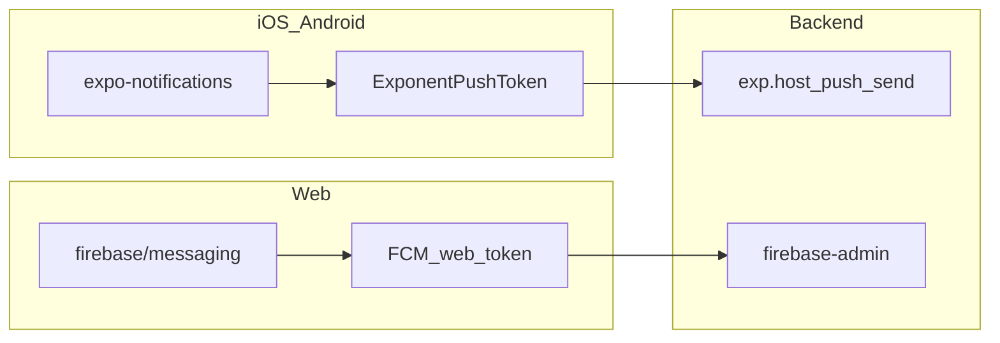

# Push notifications — setup guides

IndieFundr uses a **hybrid** notification stack:

- **iOS and Android** — [Expo Push Notifications](https://docs.expo.dev/push-notifications/overview/) (`expo-notifications` + Expo Push Service). The backend sends via `https://exp.host/--/api/v2/push/send` ([`src/services/orders/pushNotify.ts`](../../src/services/orders/pushNotify.ts)).
- **Web** — [Firebase Cloud Messaging (FCM) Web Push](https://firebase.google.com/docs/cloud-messaging/js/client). The backend will send via `firebase-admin` (implementation follow-up).

Use **one Firebase project** for both Android FCM credentials (required by EAS/Expo for Android delivery) and the Web app. That keeps keys and project IDs aligned.



## Guides

| Guide | When to use |
|-------|-------------|
| [EXPO_PUSH_IOS_ANDROID.md](./EXPO_PUSH_IOS_ANDROID.md) | Development builds, EAS credentials, FCM V1 (Android), APNs (iOS), test on device |
| [FIREBASE_WEB_PUSH.md](./FIREBASE_WEB_PUSH.md) | Web app in Firebase, VAPID keys, service worker, Firebase Admin for sending |

Complete the **Expo guide first** if you are setting up from scratch — it creates the Firebase project used by the web guide.

## Prerequisites (both guides)

- Expo account — [https://expo.dev/signup](https://expo.dev/signup)
- Google account (Firebase Console)
- Apple Developer Program membership for production iOS push ([https://developer.apple.com/programs/](https://developer.apple.com/programs/))
- A **development build** for native push testing (remote push does not work in Expo Go on Android from SDK 53+)

## Environment variables cheat sheet

### Frontend (native — after wiring client registration)

No extra env vars for Expo Push tokens. You need `extra.eas.projectId` in [`frontend/app.config.js`](../../../frontend/app.config.js) (see Expo guide).

### Frontend (web — implementation follow-up)

```bash
EXPO_PUBLIC_FIREBASE_API_KEY=
EXPO_PUBLIC_FIREBASE_AUTH_DOMAIN=
EXPO_PUBLIC_FIREBASE_PROJECT_ID=
EXPO_PUBLIC_FIREBASE_MESSAGING_SENDER_ID=
EXPO_PUBLIC_FIREBASE_APP_ID=
EXPO_PUBLIC_FIREBASE_VAPID_KEY=
```

### Backend

Expo Push Service needs **no secret** on the server today.

For web push (follow-up):

```bash
# Path to service account JSON (never commit)
FIREBASE_SERVICE_ACCOUNT_PATH=./secrets/firebase-sa.json
```

Web app URL (marketing / deep links): `APP_WEB_URL` in [`backend/.env.example`](../../.env.example) (default `http://localhost:8081`).

## Secrets — never commit

Add to `.gitignore` (repo root or `frontend/` / `backend/` as appropriate):

```
# Firebase / FCM
google-services.json
*-firebase-adminsdk-*.json
firebase-sa.json
secrets/

# Apple
*.p8
```

`google-services.json` contains public-facing IDs and *may* be committed per Expo docs; many teams still gitignore it and inject via CI. **Always** gitignore service account private keys.

## IndieFundr integration map

| Piece | Location | Status |
|-------|----------|--------|
| `expo-notifications` plugin | [`frontend/app.config.js`](../../../frontend/app.config.js) | Done |
| Send native push | [`backend/src/services/orders/pushNotify.ts`](../../src/services/orders/pushNotify.ts) | Done |
| Used on invest complete/fail | [`backend/src/services/orders/purchaseOrderProcessor.ts`](../../src/services/orders/purchaseOrderProcessor.ts) | Done |
| Token API | `POST /api/users/notifications/token` → `User.device` | Done |
| Redux token actions | [`frontend/redux/actions/pushNotificationsActions.js`](../../../frontend/redux/actions/pushNotificationsActions.js) | Done |
| Client `getExpoPushTokenAsync` + register on login | — | **Not wired** |
| Firebase web client + `firebase-messaging-sw.js` | [`frontend/lib/firebase/webPush.ts`](../../../frontend/lib/firebase/webPush.ts), [`frontend/hooks/useWebPushRegistration.ts`](../../../frontend/hooks/useWebPushRegistration.ts) | Done (desktop web) |
| Hybrid push router (`sendPushNotification`) | [`backend/src/services/orders/pushNotify.ts`](../../src/services/orders/pushNotify.ts) | Done |
| `firebase-admin` sender for web | [`backend/src/lib/firebase/admin.ts`](../../src/lib/firebase/admin.ts) | Done (requires `FIREBASE_SERVICE_ACCOUNT_PATH`) |
| Referral `NotificationOutbox` | [`specs/referral-recovery/README.md`](../../specs/referral-recovery/README.md) Phase 5 | Spec only |

### Next: wire into the app (after credentials work)

1. **Native** — On app start (iOS/Android only): request permission → `getExpoPushTokenAsync({ projectId })` → dispatch `setPushNotificationsToken` → `POST /api/users/notifications/token`.
2. **Web** — On desktop web after login: Firebase `getToken` → `POST /api/users/notifications/token` (same `User.device` field; token type detected by prefix at send time).
3. **Backend** — `sendPushNotification` routes Expo vs FCM tokens. Remaining: implement `NotificationOutbox` for referral events.

## Official references

- [Expo — Push notifications setup](https://docs.expo.dev/push-notifications/push-notifications-setup/)
- [Expo — FCM V1 credentials](https://docs.expo.dev/push-notifications/fcm-credentials/)
- [Expo — Push notifications tool](https://expo.dev/notifications)
- [Firebase — FCM JS client](https://firebase.google.com/docs/cloud-messaging/js/client)
- [Referral recovery spec — Phase 5](../../specs/referral-recovery/README.md)
