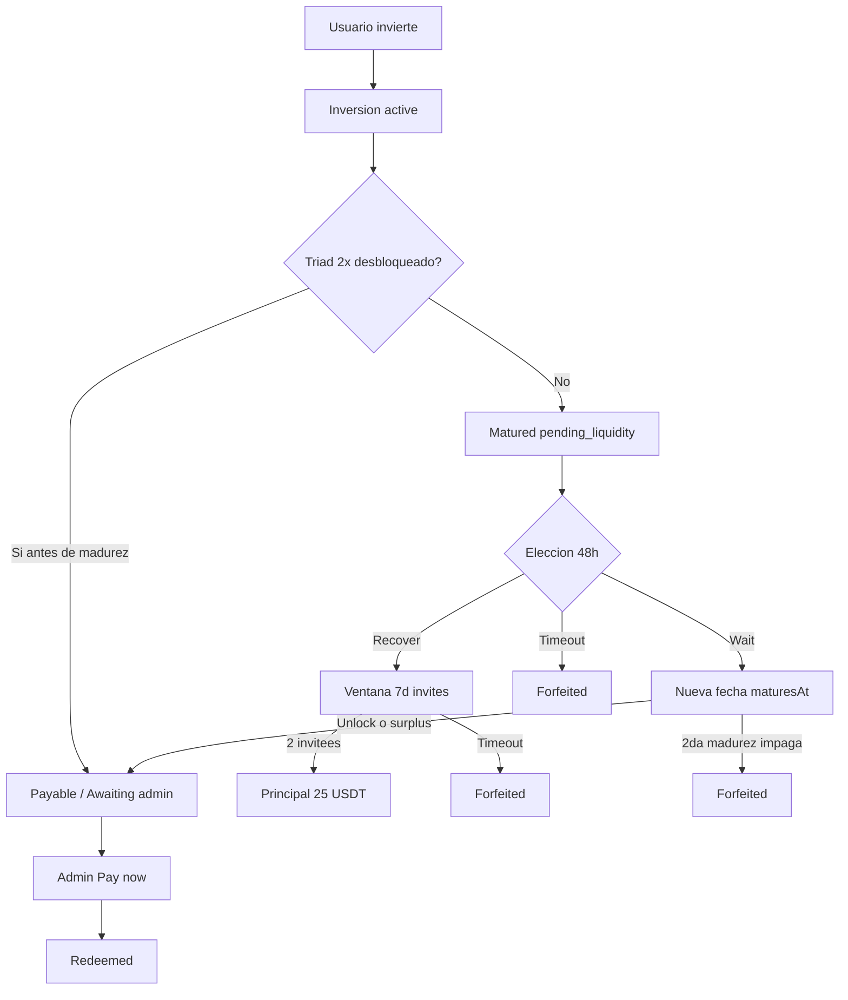

# Manual testing — Shasta testnet (pre-producción)

Documento de solo lectura para QA manual. Marca cada paso con `[x]` al completarlo.

**Convenciones**

- **Usuarios de prueba:** A, B, C, D, E, F, G, H, I, J, K, L, M, N, O (emails distintos).
- **Fondo X (escenario núcleo):** Hustle Collective — `balanced-growth` (15 % → 25 USDT pagan ~28.75 USDT).
- **Red:** Shasta (`BLOCKCHAIN_NETWORK=testnet`).
- **Admin:** panel en `/admin/login` (OTP al email de `ADMIN_ALLOWED_EMAIL`).
- Pasos **\[Admin\]** requieren el panel de administración.

---

## Valores de referencia (no son pasos)

| Concepto | Valor por defecto |
|----------|-------------------|
| Monto inversión nivel 0–1 | 25 USDT |
| Monto inversión nivel 2 | 50 USDT |
| Monto inversión nivel 3–4 | 75 USDT |
| Monto inversión nivel 5+ | 100 USDT |
| Triad unlock (head $25) | 50 USDT de inversores **posteriores** (ej. B + C) |
| Triad unlock (head $50) | 100 USDT posteriores |
| Bono invitee / inviter | 2 USDT c/u |
| Recovery principal | 25 USDT (sin ganancias proyectadas) |
| Invitees recovery | 2 en 7 días |
| Ventana elección madurez impaga | 48 h |
| Plazo inversión (backend sin `INVESTMENT_TERM`) | ~3 días |
| OTP usuario | 1 h TTL; resend cada 60 s |

**Catálogo de fondos**

| ID | Nombre | Retorno 90d |
|----|--------|-------------|
| `aggressive-alpha` | High Roller Syndicate | 40 % |
| `growth-partners` | Arbitrage Circuit | 25 % |
| `balanced-growth` | Hustle Collective | 15 % |
| `stable-yield` | Bonus & Promo Lane | 10 % |
| `capital-shield` | Matched Edge | 6 % |

---

## Diagrama de flujo principal

---

## Hoja de registro (rellenar a mano)

| Usuario | Email | Wallet | Nivel | Código referido | Notas |
|---------|-------|--------|-------|-----------------|-------|
| A | | | | | |
| B | | | | | |
| C | | | | | |
| D | | | | | |
| E | | | | | |
| F | | | | | |
| G | | | | | |
| H | | | | | |
| I | | | | | |
| J | | | | | |
| K | | | | | |
| L | | | | | |
| M | | | | | |
| N | | | | | |
| O | | | | | |

---

## 0. Pre-requisitos y setup

- [ ] 0.1 Backend corriendo (`npm run dev` en `backend/`, puerto 3000).
- [ ] 0.2 Frontend corriendo (`npm run dev` en `frontend/`, puerto 8081 o Expo web).
- [ ] 0.3 `BLOCKCHAIN_NETWORK=testnet` en `backend/.env`.
- [ ] 0.4 Treasury configurada (`TREASURY_ADDRESS`, `TREASURY_PRIVATE_KEY`) con TRX y USDT en Shasta.
- [ ] 0.5 `RESEND_API_KEY` y `MAILING_DOMAIN` configurados (o usar OTP en consola dev con `FRONTEND_DOMAIN` localhost).
- [ ] 0.6 `ADMIN_ALLOWED_EMAIL` definido; puedes iniciar sesión en `/admin/login`.
- [ ] 0.7 (Opcional acelerar madurez) Añadir `INVESTMENT_TERM=30Mi` o `INVESTMENT_TERM=12H` en `backend/.env` y reiniciar backend.
  - *Solo afecta inversiones nuevas creadas después del cambio.*
- [ ] 0.8 Preparar ≥ 8 emails de prueba (Gmail +alias o dominios distintos).
- [ ] 0.9 Tener faucet Shasta USDT/TRX o wallets externas para enviar USDT a direcciones custodiales.
- [ ] 0.10 Anotar en la hoja de registro cada usuario que vayas creando.
- [ ] 0.11 Verificar `GET /api/funds` devuelve los 5 fondos y el plazo actual.
- [ ] 0.12 (Opcional) Probar cron madurez en dev: `GET http://localhost:3000/api/cron/maturity` (sin `CRON_SECRET` en local según `.env.example`).
- [ ] 0.13 Confirmar `REVENUE_ENGINE_ENABLED` no está en `false` (ledger y unlock activos).
- [ ] 0.14 Confirmar `FEE_SPONSORSHIP_ENABLED=true` — usuarios solo necesitan USDT para invertir.
- [ ] 0.15 Abrir este archivo en un editor y dejarlo visible durante toda la sesión de QA.

---

## 1. Autenticación y onboarding

### 1.1 Registro Usuario A

- [ ] 1.1.1 Abrir app → pantalla Login → introducir email nuevo (Usuario A) → Continue.
- [ ] 1.1.2 Recibir OTP por email (o leer `[auth:dev:login-otp]` en consola backend si aplica).
- [ ] 1.1.3 Introducir OTP de 6 dígitos → entrar a la app (tabs Home, Invest, Portfolio, Invite, Settings).
  - *Esperado: sesión creada; `hasVerifiedMail` true.*
- [ ] 1.1.4 En Home, verificar que aparece wallet (balance puede ser 0).
- [ ] 1.1.5 En Profile (avatar en Home), verificar nivel **Starter (0)**.

### 1.2 Login usuario existente

- [ ] 1.2.1 Cerrar sesión (Settings → Log out).
- [ ] 1.2.2 Volver a Login con el mismo email A → OTP → entrar.
  - *Esperado: misma cuenta, datos preservados.*

### 1.3 OTP — resend y expiración

- [ ] 1.3.1 Iniciar login con email de prueba nuevo; en pantalla OTP pulsar resend antes de 60 s.
  - *Esperado: botón deshabilitado o error 429 con tiempo de espera.*
- [ ] 1.3.2 Esperar 60 s → resend → recibir nuevo código.
- [ ] 1.3.3 (Opcional, lento) Usar OTP tras > 1 h sin verificar.
  - *Esperado: mensaje de código expirado.*

### 1.4 Deep link referido sin sesión

- [ ] 1.4.1 Sin sesión, abrir URL `http://localhost:8081/invite?code=CODIGO_DE_A` (o dominio configurado).
  - *Esperado: redirección a Login; código guardado en pending.*
- [ ] 1.4.2 Completar registro/login como Usuario B con otro email.
- [ ] 1.4.3 Ir a pestaña **Invite** → verificar banner “Code saved” / código pendiente.

### 1.5 Sesión y refresh

- [ ] 1.5.1 Con sesión activa, recargar la app (F5 en web).
  - *Esperado: sigue autenticado (refresh token).*
- [ ] 1.5.2 Log out → intentar abrir ruta protegida `/home`.
  - *Esperado: redirección a Login.*

### 1.6 Wallet al registrarse

- [ ] 1.6.1 Usuario recién registrado: Home → **Add Funds** → copiar dirección TRC-20 Shasta.
  - *Esperado: dirección válida; aviso de red testnet.*

---

## 2. Wallet — depósito, balance, retiro

### 2.1 Depósito manual (Add Funds)

- [ ] 2.1.1 Usuario A: Home → **Add Funds** → copiar dirección custodial.
- [ ] 2.1.2 Desde wallet externa Shasta, enviar ≥ 30 USDT a esa dirección.
- [ ] 2.1.3 Pull-to-refresh en Home (o esperar ~60 s sync).
  - *Esperado: balance total y disponible aumentan; fila en Activity.*
- [ ] 2.1.4 Tocar la fila de depósito → pantalla detalle de transacción coherente.

### 2.2 Balance y disponible

- [ ] 2.2.1 Verificar desglose: balance total vs USDT disponible vs invertido.
- [ ] 2.2.2 Tocar monto invertido → sheet por fondo (puede estar vacío aún).

### 2.3 Buy USDT (Transak) — opcional

- [ ] 2.3.1 Si `TRANSAK_API_KEY` configurado: Home → **Buy** → `/buy-usdt`.
- [ ] 2.3.2 Completar flujo staging en widget → volver a Home.
  - *Esperado: mensaje de que USDT puede tardar; refresh balance.*
- [ ] 2.3.3 Cancelar widget sin comprar → volver sin error fatal.

### 2.4 Retiro — validaciones

- [ ] 2.4.1 Home → **Withdraw** → monto 0 o vacío → submit.
  - *Esperado: error de validación.*
- [ ] 2.4.2 Monto mayor que disponible → error insuficiente.
- [ ] 2.4.3 Dirección Tron inválida → error tras debounce (~400 ms).
- [ ] 2.4.4 Retiro válido (ej. 5 USDT) a dirección Shasta propia → orden **pending** en Activity.

### 2.5 Retiro — fulfill admin

- [ ] 2.5.1 \[Admin\] Localizar orden de retiro del usuario → fulfill on-chain.
- [ ] 2.5.2 Usuario: refresh Activity → estado completado.
  - *Esperado: push “Withdrawal sent” (si notificaciones activas) + email recibo.*

### 2.6 Activity y sync

- [ ] 2.6.1 Scroll infinito en Activity (si hay > 50 filas, opcional).
- [ ] 2.6.2 Durante sync chain, verificar banner de sincronización si aplica.

### 2.7 Reserva por orden de compra pending

- [ ] 2.7.1 Usuario con balance 30 USDT: iniciar subscribe 25 USDT (no completar admin aún).
- [ ] 2.7.2 Verificar que **disponible** baja (~5 USDT o reserva según UI) mientras orden pending.
- [ ] 2.7.3 \[Admin\] Fulfill orden → disponible se normaliza tras inversión activa.

---

## 3. Escenario núcleo — triad unlock (Usuarios A, B, C)

*Objetivo: A invierte primero; B y C desbloquean el pago de A (2 × 25 = 50 USDT posteriores).*

### 3.1 Usuario A — primera inversión

- [ ] 3.1.1 Usuario A con ≥ 25 USDT disponible → pestaña **Invest**.
- [ ] 3.1.2 Abrir **Hustle Collective** (`balanced-growth`) → Invest.
- [ ] 3.1.3 Modal Subscribe: verificar monto **25 USDT** (nivel 0), fee estimate, riesgo.
- [ ] 3.1.4 Confirmar subscribe → volver a Home con orden pending.
- [ ] 3.1.5 \[Admin\] `/admin/subscriptions` → fulfill purchase order de A (USDT llegó a treasury).
  - *Esperado: inversión `active`; email “Investment approved”; push si configurado.*
- [ ] 3.1.6 Usuario A → **Portfolio** → holding activo, barra de progreso hacia madurez.
  - *Esperado: aún **no** “Awaiting admin payout” (sin unlock).*

### 3.2 Usuario B — segundo inversor (mismo fondo)

- [ ] 3.2.1 Registrar Usuario B (email nuevo) → depositar ≥ 25 USDT (Add Funds).
- [ ] 3.2.2 B → Invest → **mismo fondo** `balanced-growth` → subscribe 25 USDT.
- [ ] 3.2.3 \[Admin\] Fulfill orden de B.
- [ ] 3.2.4 \[Admin\] Abrir `/admin/investments` → verificar que inversión de **A** aún no payable O revisar columna unlock.
  - *Esperado: con solo B, unlock de A ($50 requerido) **incompleto**.*

### 3.3 Usuario C — tercer inversor (completa triad)

- [ ] 3.3.1 Registrar Usuario C → depositar ≥ 25 USDT.
- [ ] 3.3.2 C → subscribe 25 USDT en `balanced-growth`.
- [ ] 3.3.3 \[Admin\] Fulfill orden de C.
- [ ] 3.3.4 \[Admin\] Verificar inversión de **A**: `payoutUnlockedAt` set / estado payable.
- [ ] 3.3.5 Usuario A → Portfolio → etiqueta **“Awaiting admin payout”** (o equivalente).
  - *Esperado: B + C aportaron 50 USDT posteriores → desbloqueo de head A.*

### 3.4 Madurez y pago de A

- [ ] 3.4.1 Esperar `maturesAt` de A (o `INVESTMENT_TERM` corto + cron `/api/cron/maturity`).
- [ ] 3.4.2 Usuario A refresh Portfolio → inversión `matured`, sigue payable.
  - *Esperado: email “Investment matured” (sin elección impaga porque ya estaba unlocked).*
- [ ] 3.4.3 \[Admin\] `/admin/investments` → **Pay now** para inversión de A → broadcast on-chain.
- [ ] 3.4.4 \[Admin\] **Confirm payout on-chain** cuando tx confirme.
- [ ] 3.4.5 Usuario A: Portfolio → `redeemed`; wallet +~28.75 USDT (25 + 15 %).
- [ ] 3.4.6 Verificar Activity “Payout received”, email recibo PDF adjunto.

### 3.5 Variante — head $50 desbloqueado por un $50 (Usuario D)

- [ ] 3.5.1 Subir Usuario D a **nivel 2** (ver sección 4) o usar cuenta ya en L2.
- [ ] 3.5.2 D invierte **50 USDT** primero en un fondo (ej. `growth-partners`).
- [ ] 3.5.3 \[Admin\] Fulfill D.
- [ ] 3.5.4 Usuario E (L2) invierte **50 USDT** después en el **mismo** fondo.
- [ ] 3.5.5 \[Admin\] Fulfill E → verificar unlock de D (100 USDT requerido: un solo 50 **no** basta; hace falta segundo 50).
- [ ] 3.5.6 Usuario F invierte 50 USDT → fulfill → D desbloqueado.

### 3.6 Variante negativa — un solo $25 no desbloquea head $25

- [ ] 3.6.1 Usuario E (nuevo): invertir 25 USDT solo en `stable-yield` como primero.
- [ ] 3.6.2 \[Admin\] Fulfill E.
- [ ] 3.6.3 Usuario F: un solo 25 USDT después en mismo fondo → fulfill.
- [ ] 3.6.4 Verificar head E **sin** unlock (falta segundo 25).

### 3.7 Variante — Pay with surplus (FIFO)

- [ ] 3.7.1 Crear inversión G que madure **sin** triad unlock pero con surplus en treasury (varias subs previas).
- [ ] 3.7.2 \[Admin\] Investments → fila G elegible **Pay with surplus** (si surplus ≥ payout).
- [ ] 3.7.3 Ejecutar surplus payout → confirm on-chain → G `redeemed`.
- [ ] 3.7.4 Segunda inversión H matured sin unlock: si surplus insuficiente tras pagar G, H **no** debe pagarse (FIFO).

### 3.8 Usuario no puede auto-claim

- [ ] 3.8.1 En Portfolio, verificar que **no** aparece botón “Claim payout” activo.
- [ ] 3.8.2 (Opcional API) `POST /api/investments/:id/redeem` → 403 manual payout.

---

## 4. Niveles de jugador y límites de slots

### 4.1 Nivel 0 — montos y límites

- [ ] 4.1.1 Usuario nivel 0: Subscribe muestra solo **25 USDT** (no editable a 50).
- [ ] 4.1.2 Abrir 1 inversión en `balanced-growth` → OK.
- [ ] 4.1.3 Intentar 2.ª abierta en **el mismo** fondo sin cerrar la 1.ª.
  - *Esperado: error slots / SLOTS_FULL por fondo.*
- [ ] 4.1.4 Abrir inversiones en **3 fondos distintos** (3 totales) → OK.
- [ ] 4.1.5 Intentar 4.ª inversión abierta en cualquier fondo.
  - *Esperado: TOTAL_INVESTMENTS_CAP.*

### 4.2 Progresión 0 → 1 (Builder)

- [ ] 4.2.1 Usuario nuevo L0: completar al menos **3** subscribes lifetime (pueden quedar abiertas).
- [ ] 4.2.2 Completar **1** inversión (admin payout → `redeemed` O recovery → `referral_recovered`).
- [ ] 4.2.3 Profile → verificar nivel **1 Builder**; chips “2 slots per fund”, “5 total open”.
- [ ] 4.2.4 Subscribe modal nivel 1: sigue **25 USDT** por inversión.

### 4.3 Progresión 1 → 2 (Investor)

- [ ] 4.3.1 Completar **3** inversiones exitosas (`redeemed` o `referral_recovered`).
- [ ] 4.3.2 Tener posiciones en **≥ 2 fondos distintos** (activas o histórico).
- [ ] 4.3.3 Profile → nivel **2 Investor**.
- [ ] 4.3.4 Subscribe modal: monto **50 USDT** por inversión.
- [ ] 4.3.5 Intentar subscribe con `cost: 25` vía API (opcional) → 400 invalid.

### 4.4 Progresión 2 → 3 (Strategist)

- [ ] 4.4.1 Tener **≥ 5** inversiones completadas lifetime.
- [ ] 4.4.2 Al menos **1** `redeemed` (payout admin, no solo recovery).
- [ ] 4.4.3 Profile → nivel **3**; subscribe **75 USDT**.

### 4.5 Progresión 3 → 4 (Master)

- [ ] 4.5.1 Usuario L3 con código referido: invitar amigo que complete **primera** inversión.
- [ ] 4.5.2 Profile → nivel **4 Master**; hasta 5 slots/fondo, 20 abiertas totales.

### 4.6 Progresión 4 → 5 (Elite) — largo plazo

- [ ] 4.6.1 Invertir en **4 fondos distintos** acumulados.
- [ ] 4.6.2 **10+** inversiones completadas.
- [ ] 4.6.3 **3+** referidos con bono inviter pagado (qualified + invirtieron).
- [ ] 4.6.4 Profile → nivel **5 Elite**; subscribe **100 USDT**.

### 4.7 Reinversión para subir nivel

- [ ] 4.7.1 Tras `redeemed`, reinvertir ganancias en nuevo fondo para diversificar.
- [ ] 4.7.2 Verificar que nivel **no baja** nunca tras un mal resultado (forfeit no degrada).

### 4.8 Power cards por nivel

- [ ] 4.8.1 L0: Profile → Power cards → 1 Recovery Invite, 1 Extra Time disponibles.
- [ ] 4.8.2 Tras subir a L1: +2 Recovery, +1 Extra Time (acumulativo en UI).

---

## 5. Referidos estándar (sin recovery)

### 5.1 Inviter debe invertir primero

- [ ] 5.1.1 Usuario A **sin** inversión completada → pestaña Invite.
  - *Esperado: banner “Invest once to start earning when friends join.”*
- [ ] 5.1.2 A completa primera inversión (admin fulfill) → banner desaparece; código visible.

### 5.2 Deep link y pending

- [ ] 5.2.1 A copia código / share link `{APP_WEB_URL}/invite?code=XXXXXXXX`.
- [ ] 5.2.2 B (nuevo) abre link → login/signup → Invite muestra código guardado.
- [ ] 5.2.3 Home Activity de B: línea pending “+2.00 USDT · invest to unlock”.

### 5.3 Primera inversión del invitee

- [ ] 5.3.1 B deposita USDT → subscribe 25 USDT cualquier fondo.
- [ ] 5.3.2 \[Admin\] Fulfill B → referral qualified.
- [ ] 5.3.3 \[Admin\] Fulfill **referral payout orders** (invitee + inviter).
- [ ] 5.3.4 B wallet +2 USDT; A wallet +2 USDT.
- [ ] 5.3.5 Activity: “Referral bonus” en ambas cuentas.

### 5.4 Tercer referido estándar

- [ ] 5.4.1 C usa código de A → invierte → admin fulfill subs + referral payouts.
- [ ] 5.4.2 A recibe otro +2 USDT (modo estándar, no recovery).

### 5.5 Redeem manual (pre-invest)

- [ ] 5.5.1 Usuario D nuevo → Invite → sección Redeem → pegar código válido de A → Redeem.
- [ ] 5.5.2 Modal éxito (+2 pending) → invertir → mismos pasos 5.3.

### 5.6 Errores de redeem

- [ ] 5.6.1 Redeem con **propio** código → toast SELF_REFERRAL.
- [ ] 5.6.2 Código inválido `ZZZZZZZZ` → INVALID_CODE.
- [ ] 5.6.3 Tras redeem un código, intentar **otro** código distinto → ALREADY_REDEEMED.
- [ ] 5.6.4 Tras **primera** inversión completada, intentar redeem otro código → NOT_ELIGIBLE_TO_REDEEM.

### 5.7 Inviter sin inversión — sin bono

- [ ] 5.7.1 Usuario sin invertir comparte código; amigo invierte.
  - *Esperado: invitee puede recibir bono; inviter no hasta que invierta (reglas `canEarnInviterRewards`).*

---

## 6. Madurez impaga — elección 48 h

*Preparación: inversiones que maduran **sin** triad unlock y sin surplus FIFO. Usar fondo con pocos inversores o term corto.*

### 6.1 Rama A — Recover via invites

- [ ] 6.1.1 Usuario F: único inversor en fondo (o sin unlockers) → subscribe 25 → admin fulfill.
- [ ] 6.1.2 Esperar madurez (+ cron si aplica).
- [ ] 6.1.3 F abre app → modal **Unpaid maturity choice** (48 h countdown).
- [ ] 6.1.4 Verificar opciones: **Recover via invites** (Recovery Invite card) y **Wait longer**.
- [ ] 6.1.5 Elegir **Recover** → confirmar → carta consumida.
  - *Esperado: email choice confirmed; `referral_recovery` resolution.*
- [ ] 6.1.6 Cerrar y reabrir app → **RecoverySympathyModal** (si no dismissed).
- [ ] 6.1.7 Invite tab F: progreso **0/2**, countdown 7 días.

- [ ] 6.1.8 Usuario G: deep link código F → signup → subscribe → admin fulfill.
  - *Esperado: F ve **1/2** friends invested.*
- [ ] 6.1.9 Usuario H: mismo flujo → **2/2**.
- [ ] 6.1.10 \[Admin\] Fulfill referral payout → **principal recovery 25 USDT** a F.
- [ ] 6.1.11 F Portfolio: holding `referral_recovered` (no ganancias proyectadas).
- [ ] 6.1.12 Usuario I: tercer referido en misma ventana recovery → F recibe solo **+2 USDT** inviter (no otro principal 25).

### 6.2 Rama B — Wait longer (Extra Time)

- [ ] 6.2.1 Usuario J: madura impaga → modal elección.
- [ ] 6.2.2 Elegir **Wait longer** → slider días (mín 7, máx según plazo) → confirmar.
  - *Esperado: inversión vuelve `active`; nueva fecha madurez; Extra Time card consumida.*
- [ ] 6.2.3 Email / Portfolio: “Extended — waiting”.

#### 6.2.B1 — Segunda madurez con unlock feliz

- [ ] 6.2.B1.1 Tras extensión, usuarios K y L invierten en mismo fondo **después** de J → fulfill.
- [ ] 6.2.B1.2 J obtiene triad unlock antes de 2.ª madurez.
- [ ] 6.2.B1.3 2.ª madurez → admin Pay now → J `redeemed` con payout completo.

#### 6.2.B2 — Segunda madurez sin liquidez → forfeit

- [ ] 6.2.B2.1 Usuario J2: extensión sin nuevos inversores.
- [ ] 6.2.B2.2 2.ª madurez impaga → **forfeit inmediato** `second_maturity_unpaid`.
- [ ] 6.2.B2.3 Portfolio: badge forfeited; principal no devuelto.

### 6.3 Rama C — Sin elección en 48 h

- [ ] 6.3.1 Usuario M: madura impaga → **no** elegir opción.
- [ ] 6.3.2 Esperar > 48 h (+ cron forfeiture).
  - *Esperado: `choice_deadline_expired` → forfeited.*

### 6.4 Rama C — Sin cartas disponibles

- [ ] 6.4.1 Usuario N: consumir todas las Recovery Invite y Extra Time en elecciones previas (o simular nivel 0 agotado).
- [ ] 6.4.2 Nueva madurez impaga → modal muestra opciones **deshabilitadas** y aviso de forfeit.
- [ ] 6.4.3 No elegir → forfeiture al expirar timer.

### 6.5 Rama D — Recovery window expira

- [ ] 6.5.1 Usuario O: elige Recover → solo **1** amigo invierte en 7 días.
- [ ] 6.5.2 Esperar fin ventana 7 d (+ cron).
  - *Esperado: `recovery_window_expired` → forfeited.*
- [ ] 6.5.3 Referidos posteriores solo generan bonos estándar 2+2, no recovery.

### 6.6 Interacción modales

- [ ] 6.6.1 Con elección 48 h pending, verificar que **no** aparece Sympathy modal encima.
- [ ] 6.6.2 Dismiss Sympathy → no reaparece por `SYMPATHY_MODAL_COOLDOWN_DAYS` (7 d).
- [ ] 6.6.3 Deep link email: `/portfolio?openMaturityChoice=<id>` abre modal correcto.

### 6.7 Reminder email

- [ ] 6.7.1 Con elección pending y < 24 h restantes, ejecutar cron maturity/notifications.
  - *Esperado: email reminder “choose your next step”.*

---

## 7. Forfeiture y estados terminales

- [ ] 7.1 `choice_deadline_expired`: label “Term ended — no choice made”.
- [ ] 7.2 `second_maturity_unpaid`: label “Term ended — fund unpaid”.
- [ ] 7.3 `recovery_window_expired`: label “Recovery window ended”.
- [ ] 7.4 Verificar principal **no** acreditado en wallet tras forfeit.
- [ ] 7.5 Verificar ganancias proyectadas no pagadas.
- [ ] 7.6 Activity muestra evento coherente (sin payout).
- [ ] 7.7 Detalle transacción de inversión forfeited legible.
- [ ] 7.8 Forfeit no reduce nivel de jugador.
- [ ] 7.9 Segunda inversión del mismo usuario tras forfeit funciona normal.

---

## 8. Player powers y Profile

- [ ] 8.1 Home → avatar → Profile hub expandido.
- [ ] 8.2 Sección **Power cards**: disponibles / usadas / ganadas por tipo.
- [ ] 8.3 Tap fila de nivel → sheet con perks y requisitos siguiente nivel.
- [ ] 8.4 Consumir Recovery en §6.1 → contador “used” incrementa.
- [ ] 8.5 Consumir Extra Time en §6.2 → contador “used” incrementa.
- [ ] 8.6 Subir de L0 a L1 → cartas adicionales sin perder las no usadas.
- [ ] 8.7 API `GET /api/player-levels` coherente con UI (opcional dev tools).

---

## 9. Notificaciones y emails

### 9.1 Emails

- [ ] 9.1.1 OTP signup/login recibido (logo embebido CID).
- [ ] 9.1.2 Investment approved tras fulfill orden.
- [ ] 9.1.3 Investment matured (paid path).
- [ ] 9.1.4 Investment matured con elección requerida (link Portfolio).
- [ ] 9.1.5 Choice confirmed (recover o extend).
- [ ] 9.1.6 Unpaid maturity reminder (< 24 h).
- [ ] 9.1.7 Payout receipt PDF (inversión redimida).
- [ ] 9.1.8 Withdrawal sent.
- [ ] 9.1.9 Referral bonus (+2).
- [ ] 9.1.10 Principal recovery (+25).

### 9.2 Push (web desktop)

- [ ] 9.2.1 Settings → activar Notifications (Firebase `EXPO_PUBLIC_FIREBASE_*` configurado).
- [ ] 9.2.2 Investment approved → push.
- [ ] 9.2.3 Investment matured → push.
- [ ] 9.2.4 Payout / withdrawal / referral → push correspondiente.
- [ ] 9.2.5 (Nota) iOS/Android native: toggle “coming soon” — no bloqueante para web.

---

## 10. Admin panel — checklist operativo

### 10.1 Login admin

- [ ] 10.1.1 `/admin/login` → OTP solo para `ADMIN_ALLOWED_EMAIL`.
- [ ] 10.1.2 Email no autorizado → rechazado.

### 10.2 Subscriptions

- [ ] 10.2.1 Listar purchase orders pending.
- [ ] 10.2.2 Mark successful cuando USDT on-chain confirmado.
- [ ] 10.2.3 Mark failed → usuario ve inversión fallida / push fail.

### 10.3 Investments

- [ ] 10.3.1 Al cargar página, `markMaturedInvestments` actualiza filas vencidas.
- [ ] 10.3.2 Columnas pool / surplus / protected legibles.
- [ ] 10.3.3 Pay now → estado `redeeming` → Confirm on-chain → `redeemed`.
- [ ] 10.3.4 Pay with surplus solo en filas FIFO elegibles.
- [ ] 10.3.5 Orden oldest-first respetado en cola surplus.

### 10.4 Referral payouts

- [ ] 10.4.1 Tras qualify referral, órdenes payout en cola admin.
- [ ] 10.4.2 Fulfill inviter + invitee bonuses.
- [ ] 10.4.3 Fulfill principal recovery (25 USDT) separado de bonus.
- [ ] 10.4.4 **Treasury preflight:** abrir Complete referral payout → panel Treasury preflight muestra USDT/TRX y Ready: Yes/No antes de broadcast.
- [ ] 10.4.5 **Sin fondos:** treasury USDT &lt; 2 → preflight bloquea; **no** nueva tx en Tronscan treasury.
- [ ] 10.4.6 **Con fondos:** una sola tx outbound por orden; confirm on-chain SUCCESS; una fila activity.
- [ ] 10.4.7 Tronscan treasury: txs REVERT históricas ≠ payouts exitosos; contar txs vs órdenes referral (spam = más txs que órdenes).

### 10.5 Treasury (opcional)

- [ ] 10.5.1 Reconcile treasury sin drift inexplicable.
- [ ] 10.5.2 Sync on-chain history.
- [ ] 10.5.3 Revisar USDT outbound en treasury Tronscan: distinguir FAILED/REVERT de SUCCESS.

### 10.6 Autopilot (si habilitado en entorno)

- [ ] 10.6.1 Verificar que autopilot no contradice pagos manuales en mismo ID.
- [ ] 10.6.2 Referral autopilot con treasury vacío: falla en preflight, marca manual check, **no** loop de txs on-chain.
- [ ] 10.6.3 Tras 3 reintentos interrupted, autopilot avanza a siguiente orden (no spin infinito).

---

## 11. Regresión cross-fund y edge cases

- [ ] 11.1 Invertir 25 USDT en cada uno de los 5 fondos (usuarios con balance suficiente).
- [ ] 11.2 Verificar returns proyectados: 40 %, 25 %, 15 %, 10 %, 6 % sobre principal.
- [ ] 11.3 Segundo subscribe en mismo fondo con orden pending → bloqueado.
- [ ] 11.4 Fund slots full (5 abiertas en un fondo para usuario con slots ilimitados L5).
- [ ] 11.5 Portfolio pull-to-refresh actualiza estados.
- [ ] 11.6 Transaction detail desde Activity → botón “Go to Portfolio” en madurez impaga.
- [ ] 11.7 Tema claro/oscuro Settings no rompe modales inversión.
- [ ] 11.8 Logout → login otro usuario → no leakage de datos previos.
- [ ] 11.9 `GET /api/funds/estimate?fundId=` coherente con modal subscribe.
- [ ] 11.10 Insufficient USDT al subscribe → mensaje claro.
- [ ] 11.11 Legacy wallet address en usuario antiguo → error blockchain payload si aplica.
- [ ] 11.12 TREASURY no configurado en entorno vacío → 500 controlado (solo staging vacío).

---

## 12. Matriz de cierre pre-producción

Marca `[x]` en la columna **OK** al validar el escenario completo end-to-end.

| # | Escenario | Usuario(s) | Resultado esperado | OK |
|---|-----------|------------|-------------------|-----|
| 1 | Triad unlock + payout | A, B, C | A redeemed ~28.75 USDT | [ ] |
| 2 | Triad incompleto | E, F | Sin unlock con 1×25 posterior | [ ] |
| 3 | Head 50 necesita 100 | D, E, F | Unlock tras 2×50 | [ ] |
| 4 | Surplus FIFO | G, H | G redeemed; H blocked si sin surplus | [ ] |
| 5 | Referido estándar 2+2 | A, B | Bonos pagados | [ ] |
| 6 | Redeem errores | varios | Toasts correctos | [ ] |
| 7 | Recovery 2/2 | F, G, H | 25 USDT principal | [ ] |
| 8 | Recovery 3.er amigo | I | +2 inviter solo | [ ] |
| 9 | Wait + 2.ª madurez OK | J, K, L | Redeemed full | [ ] |
| 10 | Wait + 2.ª madurez fail | J2 | Forfeit second_maturity | [ ] |
| 11 | Choice timeout 48 h | M | Forfeit choice_deadline | [ ] |
| 12 | Recovery timeout 7 d | O | Forfeit recovery_window | [ ] |
| 13 | Sin power cards | N | Forfeit tras timer | [ ] |
| 14 | Nivel 0→2 | progresión | 25→50 USDT subs | [ ] |
| 15 | Slots cap L0 | L0 user | 4.ª abierta rechazada | [ ] |
| 16 | Withdraw E2E | cualquiera | USDT en wallet externa | [ ] |
| 17 | Deposit E2E | cualquiera | Balance sube | [ ] |
| 18 | Auth OTP + refresh | A | Sesión estable | [ ] |
| 19 | Emails críticos | varios | 10 templates OK | [ ] |
| 20 | Admin pay + confirm | admin | Ledger outflow | [ ] |
| 21 | No user claim | cualquiera | Sin auto-redeem | [ ] |
| 22 | 5 fondos | cross | Catálogo completo | [ ] |
| 23 | Forfeit UI labels | M,O,J2 | Copy correcto | [ ] |
| 24 | Sympathy vs choice | F | Prioridad modal | [ ] |
| 25 | Transak (opcional) | — | Widget staging | [ ] |

---

## Notas finales

- **Password reset:** no implementado en app; solo OTP login.
- **Post-invest redeem:** bloqueado por diseño (`NOT_ELIGIBLE_TO_REDEEM`).
- **Plazo:** confiar en API (`GET /api/funds`), no en constantes stale del frontend.
- **Producción:** repetir matriz §12 en `mainnet` con montos mínimos y treasury real antes del lanzamiento público.

*Última generación: documento vivo — edita checkboxes y la hoja de registro según avances.*
