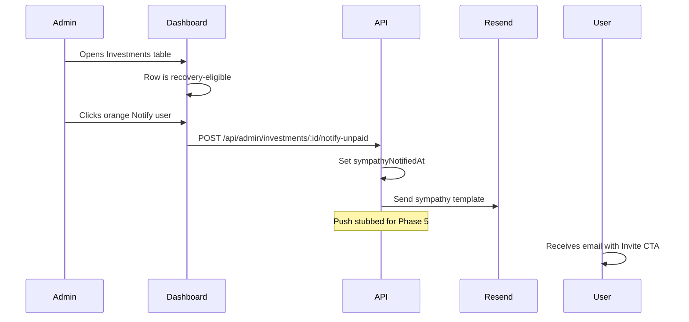
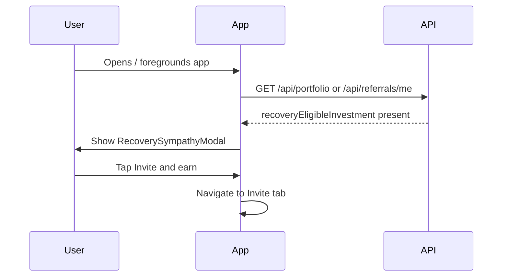
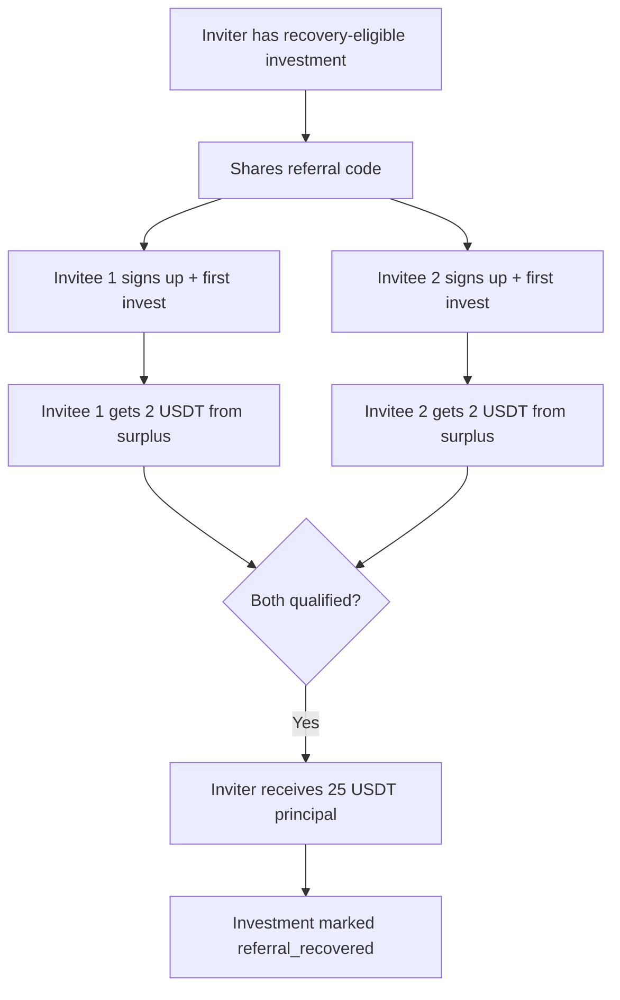
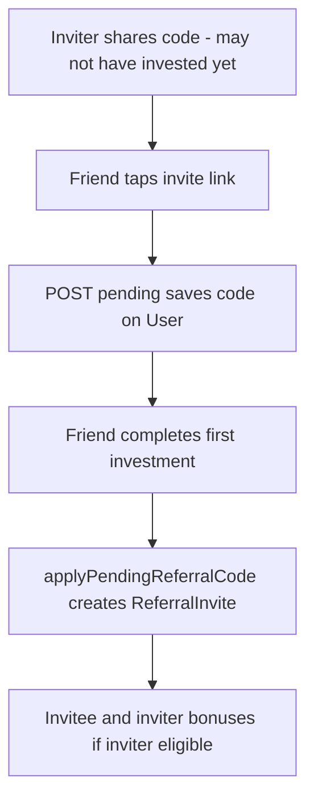
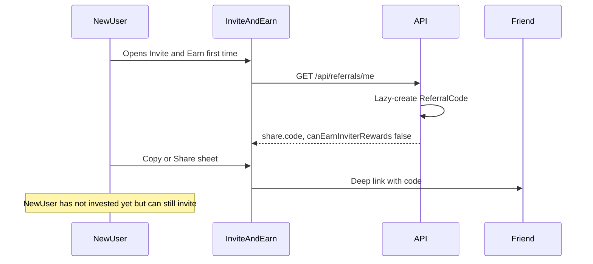
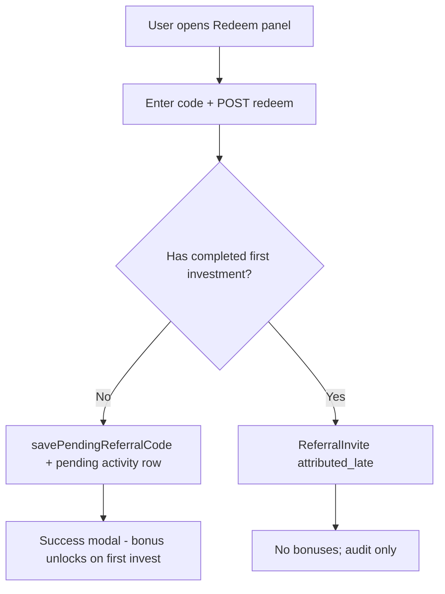
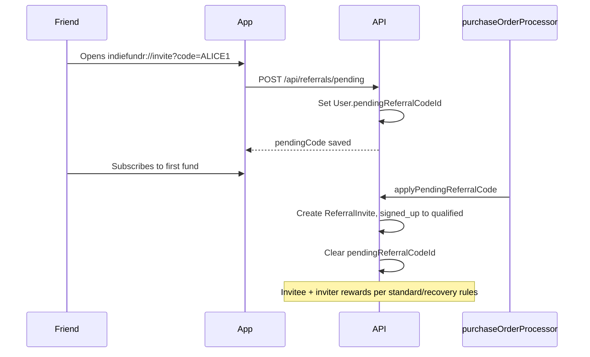
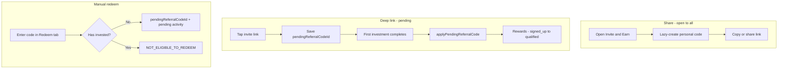
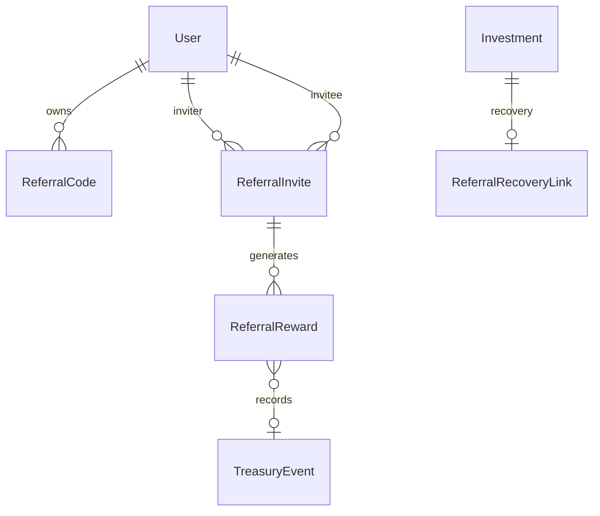

# Referral recovery & Invite & Earn — specification

Product and technical specification for **unpaid-at-maturity** user communication and the **Invite & Earn** referral program. When an investment matures but cannot be paid through the normal triad unlock or surplus FIFO paths, users receive an empathetic message and may **recover 25 USDT principal** by inviting two friends who each complete their first fund subscription. Invitees each receive **2 USDT** from treasury surplus (4 USDT total in recovery mode).

**Related:** [Revenue engine spec](../revenue-engine/README.md) (triad math, surplus, FIFO payouts)

**Configuration (planned):** `src/lib/config/referralRecovery.ts` · **Tests (planned):** `src/services/referrals/*.test.ts`

---

## Table of contents

1. [Executive summary](#executive-summary)
2. [Glossary](#glossary)
3. [Problem & current gaps](#problem--current-gaps)
4. [User journeys](#user-journeys)
5. [Unpaid-at-maturity detection](#unpaid-at-maturity-detection)
6. [Sympathy messaging](#sympathy-messaging)
7. [Referral program rules](#referral-program-rules)
8. [Reward math & treasury accounting](#reward-math--treasury-accounting)
9. [Solvency analysis & simulations](#solvency-analysis--simulations)
10. [Data model](#data-model)
11. [API reference](#api-reference)
12. [Admin UX](#admin-ux)
13. [Mobile UX](#mobile-ux)
14. [Email & notifications](#email--notifications)
15. [Anti-abuse & compliance](#anti-abuse--compliance)
16. [Feature flags & configuration](#feature-flags--configuration)
17. [Implementation phases](#implementation-phases)
18. [Acceptance criteria](#acceptance-criteria)
19. [Open questions](#open-questions)

---

## Executive summary

IndieFundr pays matured investments when either:

1. **Triad unlock** — two later subscribers unlock the head investment (`payoutUnlockedAt`), or  
2. **Surplus FIFO** — treasury surplus covers the payout in subscription order.

When **neither** path is available at maturity, the user is stuck on **"Payout pending"** with no self-service recovery.

This spec introduces:

| Capability | Description |
|------------|-------------|
| **Sympathy comms** | Admin-triggered email (+ future push) and in-app modal explaining the situation |
| **Invite & Earn tab** | Fifth app tab: **share** (open to all), **redeem** (after first invest), track referrals, recovery progress |
| **Personal referral code** | Lazy-created on first Invite & Earn visit; **any** user can share immediately |
| **Share vs redeem** | Share requires no investment; manual redeem requires ≥1 investment; deep link saves **pending** code until first invest |
| **One-time code slot** | Each user may use **one** referral code in their lifetime (pending, applied, or manual redeem) |
| **Standard referrals** | Inviter earns 2 USDT per qualified invitee; invitee sees 2 USDT pending until they invest |
| **Recovery referrals** | When inviter has a recovery-eligible investment within a **7-day window**: first 2 qualified invitees count toward **25 USDT principal** recovery; invitees always get **2 USDT**; **3rd+ invites during the window** earn standard **2 USDT inviter** bonuses |

Recovery bonuses for invitees (**4 USDT**) are funded from **`treasurySurplus`**. Principal recovery (**25 USDT**) is a separate **`referral_principal_recovery`** ledger event settled from pool liquidity (on-chain transfer to inviter wallet), not from projected earnings.

---

## Glossary

| Term | Meaning |
|------|---------|
| **A** | Principal per investment = **25 USDT** (`INVESTMENT_AMOUNT_USDT`) |
| **Triad** | Payout head + two later unlocker investments (see revenue engine) |
| **Surplus (S_sub)** | Per-subscribe credit to `treasurySurplus` ≈ 3.33–6.17 USDT depending on fund |
| **Recovery-eligible investment** | Matured, unpaid, no triad unlock, not surplus-FIFO-eligible, within **7-day recovery window** from `recoveryEligibleAt` |
| **Recovery window** | `recoveryEligibleAt` + `REFERRAL_RECOVERY_WINDOW_DAYS` (default 7); after expiry eligibility is cleared |
| **Qualified invitee** | User whose **pending** deep-link code applied on **first** active investment (not manual redeem) |
| **Recovery mode** | Inviter has ≥1 recovery-eligible investment; rewards follow recovery table |
| **Standard mode** | Inviter has no recovery-eligible investment; 2+2 USDT per qualified pair |
| **Pending invitee credit** | 2 USDT shown in activity, released when invitee subscribes to a fund |
| **Personal code** | User's own shareable `ReferralCode`; created lazily on first `GET /api/referrals/me` |
| **Pending referral code** | Code saved from deep link on `User.pendingReferralCodeId`; auto-applies on first investment |
| **Redeem (manual)** | Enter a code in Invite & Earn **after** ≥1 investment; always `attributed_late` (audit only) |
| **attributed_late** | `ReferralInvite` status for manual redeem after first investment — no bonuses, no recovery credit |

---

## Problem & current gaps

### When payouts fail today

| Condition | User sees | Admin sees |
|-----------|-----------|------------|
| Matured, no `payoutUnlockedAt` | "Payout pending" | "Waiting for two-user unlock" |
| Matured, FIFO blocked | "Payout pending" | Surplus shortfall / FIFO block reason |
| On-chain payout failed | "Payout pending" | `payoutFailureReason` |

**Code anchors:**

- Maturity: [`src/services/investments/maturity.ts`](../../src/services/investments/maturity.ts) — runs lazily when admin loads Investments page
- Triad: [`src/services/revenueEngine/payoutScheduler.ts`](../../src/services/revenueEngine/payoutScheduler.ts)
- User claim: disabled (`canUserClaim` always false; redeem API returns 403)
- Portfolio UI: [`frontend/components/invest/HoldingCard.tsx`](../../../frontend/components/invest/HoldingCard.tsx)

### Gaps this spec closes

- No user-facing explanation for unpaid maturity  
- No alternative path when triad + surplus both fail  
- No referral / invite system in schema or code  
- No transactional email beyond OTP  
- Push token API exists but frontend never registers tokens  

---

## User journeys

### Journey A — Admin notifies user



### Journey B — User opens app (recovery modal)



### Journey C — Recovery mode (2 invitees)



### Journey D — Standard mode via pending deep link (no recovery)



### Journey E — Non-investor shares code (growth funnel)



### Journey F — Manual redeem (pending or attributed_late)



### Journey G — Deep link pending → first invest qualifies



---

## Unpaid-at-maturity detection

### Canonical predicate

```typescript
function isReferralRecoveryEligible(investment, ledger, fifoEligibleIds): boolean {
  return (
    investment.status === 'matured' &&
    investment.payoutUnlockedAt == null &&
    !fifoEligibleIds.includes(investment.id) &&
    investment.status not in ['redeeming', 'redeemed', 'referral_recovered'] &&
    investment.referralRecoveryCompletedAt == null
  );
}
```

### Recommended maturity refresh

Today `markMaturedInvestments` runs only when admin opens Investments. **Recommendation:**

- Run maturity check on `GET /api/investments` (portfolio) and admin fetch  
- Optional daily cron for `sympathyNotifiedAt` batch jobs  

### Edge cases

| Case | Handling |
|------|----------|
| Still `active` past `maturesAt` | Treat as recovery-eligible once maturity job runs |
| Later gains triad unlock | No longer recovery-eligible; normal Pay now |
| Later becomes FIFO-eligible | No longer recovery-eligible; admin surplus path |
| Multiple matured unpaid | One recovery campaign per investment; referrals can count toward oldest eligible first (configurable) |
| Partial recovery (1/2 invitees) | Show progress; no principal until both qualify |

---

## Sympathy messaging

### User-facing copy (default)

> We're sorry — we couldn't grow your money on this fund this cycle. Your **25 USDT principal** is still owed, but we need more activity in the pool to pay everyone fairly.  
>  
> **Invite two friends** who each invest once — you'll recover your **25 USDT principal**, and they'll each earn **2 USDT** when they join.

### Admin email variant

Same message plus:

- Investment ID, fund name, `maturesAt`  
- Triad status: unlocked / waiting  
- Surplus: eligible or shortfall amount  
- Deep link: `https://app.indiefundr.com/invite?code={code}`  

### Unpaid maturity choice (recover vs wait)

When an investment matures unpaid (no triad unlock, no surplus FIFO), the user must pick **once** per investment:

| Path | Effect |
|------|--------|
| **Recover via invites** | Sets `unpaidMaturityResolution = referral_recovery`, starts `recoveryEligibleAt` window (existing invite flow) |
| **Wait longer** | Sets `unpaidMaturityResolution = term_extension`, reverts to `active`, extends `maturesAt` by 7…half-fund-term days |

`refreshRecoveryEligibilityForUser` no longer auto-starts recovery; recovery runs only after the user chooses **Recover via invites**.

**48-hour choice deadline:** On first unpaid maturity, `unpaidMaturityChoiceDeadlineAt = now + 48h`. If the user does not choose in time → `status = forfeited` (`choice_deadline_expired`).

**Forfeiture outcomes:**

| Trigger | Result |
|---------|--------|
| No choice within 48h | `forfeited` — principal not returned |
| Chose **wait**, matures unpaid again | `forfeited` immediately (`second_maturity_unpaid`) |
| Chose **recover**, 7-day invite window expires | `forfeited` (`recovery_window_expired`) |

Funds stay in pool/surplus (subscribe inflow already recorded); `TreasuryEvent.obligation_forfeiture` audits the released obligation.

API: `POST /api/investments/:id/unpaid-maturity-choice` · `GET /api/investments/unpaid-maturity-choice/pending`

### Modal behavior

- Show sympathy modal when `isReferralRecoveryEligible` (after recover choice) and (`sympathyModalDismissedAt` is null OR dismissed > 7 days ago)  
- Show **unpaid maturity choice** modal first when `needsUnpaidMaturityChoice`  
- Actions: **Invite & earn** (primary), **Dismiss** (sets `sympathyModalDismissedAt`)  
- Do not show more than once per session  

### Admin trigger

- **Orange** button with warning icon: **Notify user**  
- Sets `sympathyNotifiedAt` on investment  
- Idempotent: disabled if notified within last **7 days** unless admin confirms re-send  
- Future: enqueue push notification (Phase 5)  

---

## Referral program rules

### Eligibility matrix

| Action | Who | Investment required? | When rewards apply |
|--------|-----|----------------------|-------------------|
| **Share personal code** | Any logged-in user | No | Inviter earns only if inviter has ≥1 investment |
| **Save code via deep link** | User who has never used a code slot | No | Auto-apply on **first** invest → `qualified` |
| **Manual redeem (Invite tab)** | New user (never invested) | No | **Pending** path only — welcome bonus unlocks when both parties invest |
| **Manual redeem (Invite tab)** | User with ≥1 investment | — | `403 NOT_ELIGIBLE_TO_REDEEM` — welcome bonus not available |
| **Second code ever** | Anyone | — | `409 ALREADY_REDEEMED` |



### Who can share (invite others)

| Rule | Detail |
|------|--------|
| Who | **Any** authenticated, email-verified user |
| Investment | **Not required** to share |
| Code creation | Lazy on first `GET /api/referrals/me` or Invite tab mount |
| Uniqueness | One `ReferralCode` per user (`userId` unique) |
| Sharing | Copy, system share sheet, deep link `indiefundr://invite?code=…` |
| Earn rewards | `canEarnInviterRewards: false` until inviter has ≥1 completed investment |

Non-investors can drive signups immediately; inviter payouts still gate on investment history.

### Pending code (deep link)

| Rule | Detail |
|------|--------|
| Trigger | `indiefundr://invite?code=X` or web URL after auth |
| API | `POST /api/referrals/pending` — saves code, does **not** create `ReferralInvite` yet |
| Storage | `User.pendingReferralCodeId` if user has never used their one-time code slot |
| Conflicts | If user already has pending, completed redeem, or `referredByInviteId` → `409 ALREADY_REDEEMED` (or idempotent if same code) |
| Apply | `applyPendingReferralCode(userId, investmentId)` on **first** completed investment |
| Outcome | Create `ReferralInvite`; transition `signed_up` → `qualified` in same flow; clear pending; issue invitee + inviter bonuses per mode |
| UI | Redeem panel: “Code **FRIEND99** saved — applies when you invest” + link to Invest tab |

### Manual redeem (Invite tab)

| Rule | Detail |
|------|--------|
| Pre-invest | `POST /api/referrals/redeem` delegates to `savePendingReferralCode` — same as deep link pending path |
| Post-invest | Always **`attributed_late`** — no bonuses, no recovery credit |
| Limit | **One lifetime code slot** — same as pending (enforced via `ReferralInvite.inviteeUserId @unique`) |
| Self-referral | Reject (`SELF_REFERRAL`) |
| Idempotency | Re-submitting the **same** code → `200` with existing attribution / pending state |
| Second code | Different code after slot used → `409 ALREADY_REDEEMED` |

Pre-invest manual redeem uses the same reward path as deep link → pending → first invest. Post-invest manual redeem is for audit/attribution only.

### Who can earn inviter rewards

| Rule | Requirement |
|------|-------------|
| Minimum activity | ≥1 investment in `active`, `matured`, `redeeming`, `redeemed`, or `referral_recovered` |
| Account | Email-verified, not suspended |
| Sharing | May share code before meeting this requirement; rewards accrue only when eligible |

### Invite mechanism

- **Code format:** 8-character alphanumeric, case-insensitive (e.g. `INDIE4X2`)  
- **Deep link:** `indiefundr://invite?code=INDIE4X2` — after auth → `POST /api/referrals/pending`  
- **Web fallback:** `https://app.indiefundr.com/invite?code=INDIE4X2` → Expo web or store  
- After pending applied or manual redeem, Redeem panel shows read-only summary

### Invitee qualification

An invitee **qualifies** (rewards + recovery credit) when:

1. They arrived via **pending deep link** (code applied on first invest), **not** via manual redeem (`attributed_late`), and  
2. Their **first** `PurchaseOrder` completes → `applyPendingReferralCode` creates `ReferralInvite` and qualifies in the same transaction  

Subsequent investments do not re-trigger rewards for the same invite row.

### Mode selection

| Inviter state | Mode | Inviter reward | Invitee reward |
|---------------|------|----------------|----------------|
| Has ≥1 recovery-eligible investment (window active) | **Recovery** | 25 USDT principal when 2 qualify; **3rd+ during window** → 2 USDT inviter bonus each | 2 USDT each on first invest (from surplus) |
| No recovery-eligible investment (or window expired) | **Standard** | 2 USDT per qualified invitee | 2 USDT on first invest (via pending deep link) |

Inviter can invite unlimited users in standard mode. Recovery principal applies **once per recovery-eligible investment** (linked via `ReferralRecoveryLink`).

### Recovery window & mixed rewards

- **Window start:** `recoveryEligibleAt` is set when an investment first becomes recovery-eligible (sticky until expiry or completion).
- **Window end:** `recoveryExpiresAt = recoveryEligibleAt + REFERRAL_RECOVERY_WINDOW_DAYS` (default **7 days**).
- **On expiry:** `recoveryEligibleAt` is cleared; investment stays matured/unpaid; future invites follow **standard** 2+2 rules only.
- **Mixed rewards during active window:**

| Invite # | Recovery slot | Inviter 2 USDT | Invitee 2 USDT |
|----------|---------------|----------------|----------------|
| 1 | Yes (1/2) | No | Yes |
| 2 | Yes (2/2) → principal | No | Yes |
| 3+ (slots full or recovery complete) | No | Yes | Yes |

Example: 4 friends invest during the window → **25 USDT** principal + **2×2 USDT** inviter bonuses + **4×2 USDT** invitee bonuses.

---

## Reward math & treasury accounting

### Constants (defaults)

| Symbol | Env var | Value |
|--------|---------|-------|
| **B_invitee** | `REFERRAL_INVITEE_BONUS_USDT` | 2 |
| **B_inviter** | `REFERRAL_INVITER_BONUS_USDT` | 2 |
| **P_recovery** | `REFERRAL_RECOVERY_PRINCIPAL_USDT` | 25 |
| **N_recovery** | `REFERRAL_RECOVERY_INVITEES_REQUIRED` | 2 |

### Standard mode ledger events

When invitee qualifies (first investment completes):

```
treasurySurplus -= B_invitee     // 2 USDT
TreasuryEvent: referral_bonus_outflow (invitee)

treasurySurplus -= B_inviter     // 2 USDT  
TreasuryEvent: referral_bonus_outflow (inviter)

// Credit user wallet balances (or queue on-chain transfer)
```

Invitee bonus issued when pending code applies on first invest (`qualified`). No bonus for **`attributed_late`** (manual redeem). Optional activity row while pending deep link is saved: “+2.00 USDT · Pending — invest to unlock”.

### Recovery mode ledger events

**Per invitee** (on first invest, same as standard invitee bonus):

```
treasurySurplus -= 2
TreasuryEvent: referral_bonus_outflow (role: invitee_bonus)
```

**When 2nd invitee qualifies** (principal recovery):

```
poolAvailable -= 25
TreasuryEvent: referral_principal_recovery
Investment.status → referral_recovered
Investment.referralRecoveryCompletedAt = now
// On-chain: transfer 25 USDT to inviter main wallet
```

**Important:** Principal recovery is **25 USDT only** — projected earnings (e.g. 35 USDT on Aggressive Alpha) are **forfeited**. This matches product confirmation.

### Surplus solvency guard

Before any `referral_bonus_outflow`:

```typescript
if (treasurySurplus < bonusAmount) {
  throw new InsufficientSurplusForReferralError();
  // Queue reward as pending; retry when surplus increases
}
```

Optional monthly cap: `REFERRAL_MONTHLY_SURPLUS_CAP_USDT` — pause new referral payouts when exceeded.

### Interaction with triad / FIFO

- Referral rewards **do not** consume unlocker slots  
- Referral recovery **closes** the investment without using triad or surplus FIFO payout paths  
- New invitee subscriptions **add** `S_sub` to surplus, partially replenishing bonus draws  

---

## Solvency analysis & simulations

### Worked example — Recovery mode (Aggressive Alpha)

Assume starting ledger after cohort stress: **pool = 40**, **surplus = 9.99** (illustrative).

| Step | Event | Δ pool | Δ surplus | Surplus after |
|------|-------|--------|-----------|---------------|
| 0 | Baseline | 40.00 | — | 9.99 |
| 1 | Invitee 1 subscribes | +25 | +3.33 | 13.32 |
| 2 | Invitee 1 bonus paid | — | −2.00 | 11.32 |
| 3 | Invitee 2 subscribes | +25 | +3.33 | 14.65 |
| 4 | Invitee 2 bonus paid | — | −2.00 | 12.65 |
| 5 | Inviter principal recovery | −25 | 0 | 12.65 |

**Net surplus change from 2 invitees:** +6.66 in − 4.00 out = **+2.66**  
**Net pool change:** +50 subs − 25 recovery = **+25** (plus inviter's original principal was already in pool)

See [`simulations/referral-recovery-2-invitees.csv`](simulations/referral-recovery-2-invitees.csv) for full step ledger.

### Standard mode example (1 invitee, Balanced Growth)

| Step | Δ surplus |
|------|-----------|
| Subscribe (S_sub = 5.42) | +5.42 |
| Invitee bonus | −2.00 |
| Inviter bonus | −2.00 |
| **Net** | **+1.42** |

### Standard mode — winning inviter, 20 qualified invitees

**Scenario:** Inviter already invested and received a normal triad payout (`redeemed` / won). No recovery-eligible investment → **standard mode** only. Twenty new users sign up with the inviter's code and each completes a first **Aggressive Alpha** subscription (`S_sub = 3.33`).

**Per invitee economics (Aggressive Alpha):**

| Flow | Amount |
|------|--------|
| Subscribe | pool +25, surplus +3.33 |
| Invitee bonus | surplus −2 |
| Inviter bonus | surplus −2 |
| **Net surplus per invitee** | **−0.67** |

Bonuses are surplus-negative on Aggressive Alpha but pool-positive (+25 per sub). Over 20 invitees the pool grows even while surplus is drawn down.

#### Healthy ledger baseline (pool 200, surplus 30)

See [`simulations/standard-referral-20-invitees.csv`](simulations/standard-referral-20-invitees.csv).

| Metric | Value |
|--------|-------|
| Inviter earns | **40 USDT** (20 × 2) |
| All invitees earn | **40 USDT** (20 × 2) |
| Total bonus outflow | **80 USDT** from surplus |
| Surplus in from subs | +66.60 (20 × 3.33) |
| **Net surplus change** | **−13.40** (30.00 → 16.60) |
| **Net pool change** | **+500 USDT** (200 → 700) |
| Queued bonuses | 0 (surplus never exhausted) |

#### Stressed ledger baseline (pool 40, surplus 9.99)

Same 20 invitees on a depleted cohort (mirrors post-stress state in revenue-engine sims). See [`simulations/standard-referral-20-invitees-low-surplus.csv`](simulations/standard-referral-20-invitees-low-surplus.csv).

| Metric | Value |
|--------|-------|
| Inviter earns | **36 USDT** (2 inviter bonuses queued) |
| Invitees earn | **40 USDT** (all credited — subscribe replenishes surplus first) |
| Total bonus outflow | **76 USDT** |
| **Net surplus change** | **−9.40** (9.99 → 0.59) |
| **Net pool change** | **+500 USDT** (40 → 540) |
| Queued bonuses | 2 (spec: retry when surplus rises) |

**Fund sensitivity:** On **Balanced Growth** (`S_sub = 5.42`), each invitee nets **+1.42** surplus after both bonuses. Twenty invitees → **+28.40** net surplus (e.g. 30 → 58.40) while paying **80 USDT** in bonuses; all bonuses credit, inviter earns **40 USDT**.

| Fund | S_sub | Net surplus / invitee | 20 invitees — all bonuses paid? |
|------|-------|----------------------|--------------------------------|
| Aggressive Alpha | 3.33 | −0.67 | Yes if starting surplus ≥ ~10; may queue inviter bonuses when depleted |
| Balanced Growth | 5.42 | +1.42 | Yes — surplus grows while paying bonuses |
| Capital Shield | 6.17 | +2.17 | Yes — strongest surplus replenishment |

### When recovery is not self-funding

If surplus is near zero before referrals:

- Invitee bonuses may **queue** until invitee subscriptions replenish surplus  
- Principal recovery still requires **poolAvailable ≥ 25** and admin/on-chain execution  
- Admin dashboard should show **referral payout blocked** reasons  

---

## Data model

### New Prisma models (planned)

```prisma
model ReferralCode {
  id        String   @id @default(auto()) @map("_id") @db.ObjectId
  userId    String   @db.ObjectId
  code      String   @unique
  createdAt DateTime @default(now())
  user      User     @relation(fields: [userId], references: [id])
}

enum ReferralInviteStatus {
  pending_signup   // legacy: deep link before auth
  signed_up        // redeemed, awaiting first invest — eligible for bonuses
  qualified        // first invest complete — rewards issued
  attributed_late  // redeemed after invitee already invested — no rewards
  expired
  voided
}

model ReferralInvite {
  id             String               @id @default(auto()) @map("_id") @db.ObjectId
  inviterUserId  String               @db.ObjectId
  inviteeUserId  String               @unique @db.ObjectId  // ONE inviter per invitee lifetime
  referralCodeId String               @db.ObjectId
  status         ReferralInviteStatus @default(signed_up)
  qualifiedAt    DateTime?
  redeemedAt     DateTime             @default(now())
  createdAt      DateTime             @default(now())
  rewards        ReferralReward[]

  @@index([inviterUserId])
}

enum ReferralRewardRole {
  inviter_bonus
  invitee_bonus
  principal_recovery
}

enum ReferralRewardStatus {
  pending
  credited
  failed
  voided
}

model ReferralReward {
  id               String             @id @default(auto()) @map("_id") @db.ObjectId
  referralInviteId String             @db.ObjectId
  role             ReferralRewardRole
  amountUsdt       Decimal
  status           ReferralRewardStatus @default(pending)
  investmentId     String?            @db.ObjectId
  treasuryEventId  String?
  createdAt        DateTime           @default(now())
  creditedAt       DateTime?
}

model ReferralRecoveryLink {
  id               String     @id @default(auto()) @map("_id") @db.ObjectId
  investmentId     String     @unique @db.ObjectId
  inviterUserId    String     @db.ObjectId
  inviteIds        String[]   // exactly 2 when complete
  completedAt      DateTime?
  investment       Investment @relation(fields: [investmentId], references: [id])
}
```

### Investment extensions

| Field | Type | Purpose |
|-------|------|---------|
| `recoveryEligibleAt` | DateTime? | When marked recovery-eligible |
| `sympathyNotifiedAt` | DateTime? | Last admin/email notification |
| `referralRecoveryCompletedAt` | DateTime? | Principal returned |
| `status` | add `referral_recovered` | Distinct from `redeemed` (no projected earnings) |

### User extensions

| Field | Type | Purpose |
|-------|------|---------|
| `sympathyModalDismissedAt` | DateTime? | Modal cooldown |
| `pendingReferralCodeId` | String? | FK to inviter's `ReferralCode`; set by deep link; cleared when applied on first invest |
| `referredByInviteId` | String? | FK to `ReferralInvite`; set when pending applied or manual redeem completes |
| `referralCodeId` | String? | FK to own `ReferralCode` (denormalized cache after lazy creation) |

**Constraints:**

- `ReferralInvite.inviteeUserId @unique` — one code slot per user lifetime  
- Pending stored on `User` only; `ReferralInvite` created atomically when first investment completes (or on manual redeem)

### TreasuryEvent extensions

Add to `TreasuryEventType` enum:

- `referral_bonus_outflow`  
- `referral_principal_recovery`  

### Entity diagram



---

## API reference

### User APIs

| Method | Path | Description |
|--------|------|-------------|
| `GET` | `/api/referrals/me` | Lazy-create own code; return `share` + `redemption` (incl. pending) + mode, progress, invite list |
| `POST` | `/api/referrals/pending` | Body `{ code }` — save deep-link code on user (auth required); does not create `ReferralInvite` |
| `POST` | `/api/referrals/redeem` | Body `{ code }` — manual redeem in Invite tab; **new users only** (no prior investment) |
| `POST` | `/api/referrals/accept` | Deprecated alias → `pending` for deep links, `redeem` for manual (legacy) |
| `GET` | `/api/referrals/pending-rewards` | Invitee pending 2 USDT rows for activity feed |

**`GET /api/referrals/me` response shape (illustrative):**

```json
{
  "share": {
    "code": "INDIE4X2",
    "shareUrl": "https://app.indiefundr.com/invite?code=INDIE4X2",
    "canEarnInviterRewards": true
  },
  "redemption": {
    "canRedeem": false,
    "canRedeemReason": "NOT_ELIGIBLE_TO_REDEEM",
    "hasRedeemed": false,
    "pendingCode": "FRIEND99",
    "pendingInviterMasked": "a***@email.com",
    "code": null,
    "inviterMasked": null,
    "redeemedAt": null,
    "status": null
  },
  "mode": "recovery",
  "recovery": {
    "investmentId": "...",
    "fundName": "Aggressive Alpha",
    "qualifiedCount": 1,
    "requiredCount": 2,
    "principalUsdt": 25,
    "recoveryEligibleAt": "2026-06-01T12:00:00.000Z",
    "recoveryExpiresAt": "2026-06-08T12:00:00.000Z",
    "windowDays": 7
  },
  "inviteCount": 1,
  "invites": [
    {
      "id": "...",
      "status": "qualified",
      "signedUpAt": "...",
      "qualifiedAt": "...",
      "inviteeMasked": "j***@email.com",
      "bonusUsdt": 2,
      "bonusStatus": "credited",
      "bonusLabel": "Invested"
    }
  ],
  "totals": { "earnedUsdt": 2, "pendingUsdt": 2 }
}
```

**`POST /api/referrals/pending` — request / response:**

```json
// Request
{ "code": "FRIEND99" }

// Response 200
{
  "mode": "pending",
  "bonusUsdt": 2,
  "pendingCode": "FRIEND99",
  "pendingInviterMasked": "a***@email.com",
  "message": "Code saved — bonus unlocks when you invest"
}
```

**`POST /api/referrals/redeem` — request / response:**

```json
// Request
{ "code": "FRIEND99" }

// Response 200 (pre-invest — same as pending)
{
  "mode": "pending",
  "bonusUsdt": 2,
  "pendingCode": "FRIEND99",
  "pendingInviterMasked": "a***@email.com",
  "message": "Code saved — bonus unlocks when you invest"
}

// Response 403 (existing investor)
{
  "code": "NOT_ELIGIBLE_TO_REDEEM",
  "message": "Welcome bonuses are only for new users who have not invested yet"
}
```

**Redeem branch:**

```typescript
if (hasCompletedFirstInvestment(userId)) {
  throw NOT_ELIGIBLE_TO_REDEEM;
}
return savePendingReferralCode(userId, rawCode);
```

**Payout gate:** Neither invitee nor inviter bonus is credited until **both** have completed at least one investment. Deferred qualified invites are released when the inviter completes their first investment.

**Error codes:**

| Status | Code | When |
|--------|------|------|
| 400 | `INVALID_CODE` | Unknown code |
| 400 | `SELF_REFERRAL` | User's own code |
| 409 | `ALREADY_REDEEMED` | Code slot already used (pending, applied, or manual) |
| 403 | `NOT_ELIGIBLE_TO_REDEEM` | User already completed an investment (welcome bonus is new-users only) |
| 403 | `REFERRAL_DISABLED` | Feature flag off |

### Admin APIs

| Method | Path | Description |
|--------|------|-------------|
| `POST` | `/api/admin/investments/:id/notify-unpaid` | Send sympathy email; set `sympathyNotifiedAt` |
| `GET` | `/api/admin/referrals` | Audit list (optional Phase 6) |

### Internal hooks

| Hook | Trigger | Action |
|------|---------|--------|
| `applyPendingReferralCode` | `purchaseOrderProcessor` completes **first** investment | If `pendingReferralCodeId` set → create `ReferralInvite`, qualify, clear pending, issue rewards |
| `onReferralQualified` | After pending apply | Issue bonuses, update recovery link |
| `refreshRecoveryEligibility` | Portfolio fetch / maturity job | Set `recoveryEligibleAt` |
| `savePendingReferralCode` | `POST /api/referrals/pending` | Set `User.pendingReferralCodeId`; optional pending activity row |
| `redeemReferralCode` | `POST /api/referrals/redeem` | Manual redeem; pre-invest → pending; post-invest → `attributed_late` |

**Service locations (planned):** `src/services/referrals/pendingReferralCode.ts`, `src/services/referrals/redeemReferralCode.ts`, `src/services/referrals/referralRewardEngine.ts`

---

## Admin UX

### Orders tab — referral payout orders ([`subscriptions/page.tsx`](../../src/app/admin/(protected)/subscriptions/page.tsx))

When both inviter and invitee have invested, the system creates **`ReferralPayoutOrder`** rows (queued) instead of auto-crediting on the spot:

| Scenario | Orders created |
|----------|----------------|
| Standard qualified pair | Invitee bonus 2 USDT + Inviter bonus 2 USDT |
| Recovery slot 1 or 2 | Invitee bonus 2 USDT only; on 2nd invitee also **Principal recovery 25 USDT** to inviter |
| Recovery slots full / 3rd+ invite | Standard inviter 2 + invitee 2 |

Admin actions: **Pay from treasury** (on-chain USDT) → **Complete** (ledger + wallet activity + investment `referral_recovered` for principal). Pending rewards before this change: `npm run backfill:referral-payout-orders`.

### Investments table ([`investments/page.tsx`](../../src/app/admin/(protected)/investments/page.tsx))

| Element | When | Style |
|---------|------|-------|
| Badge **Recovery eligible** | `isReferralRecoveryEligible` | Orange outline |
| Button **Notify user** | Same + not notified in 7d | Orange, warning icon |
| Column **Sympathy sent** | Always | `sympathyNotifiedAt` or — |
| Column **Referral progress** | Recovery mode | `1/2 qualified` |

### Treasury page

- Filter `TreasuryEvent` by `referral_bonus_outflow`, `referral_principal_recovery`  
- Running total: referral spend vs surplus this month  

---

## Mobile UX

### New tab: Invite & Earn

**Route:** `frontend/app/(app)/(tabs)/invite/index.tsx`

Add 5th `NativeTabs.Trigger` in [`frontend/app/(app)/(tabs)/_layout.tsx`](../../../frontend/app/(app)/(tabs)/_layout.tsx).

**On first mount:** `GET /api/referrals/me` (lazy-creates personal code if missing).

**Layout:** segmented control or top tabs — **Share my code** | **Redeem code**

```
┌─────────────────────────────────────┐
│  Invite & earn                      │
│  [ Share my code ] [ Redeem code ]  │
├─────────────────────────────────────┤
│  SHARE (default)                    │
│  Your code: INDIE4X2  [Copy] [Share]│
│  Invest once to earn when friends   │
│    join (if !canEarnInviterRewards) │
│  Recovery progress 0/2 (if mode)    │
│  Referral list…                     │
├─────────────────────────────────────┤
│  REDEEM                             │
│  Code FRIEND99 saved — invest to    │
│    apply [Go to Invest]             │
│  — or —                             │
│  Invest once to redeem a code       │
│  — or —                             │
│  [ ____________ ]  [ Redeem ]       │
│  — or —                             │
│  ✓ You used code FRIEND99 (locked)  │
└─────────────────────────────────────┘
```

| Panel | Content |
|-------|---------|
| **Share my code** | Always available; personal code + copy + share sheet; helper “Invest once to start earning when friends join” when `!canEarnInviterRewards`; recovery banner when in recovery mode; referral list |
| **Redeem code** | State-driven UI (see table below) |

**Redeem UI states:**

| State | UI |
|-------|-----|
| `pendingCode` set | “Code **X** saved” + pending bonus on Home + CTAs to Home / Invest |
| `canRedeem: true` (slot free) | Code input + **Redeem** button; success modal → Home |
| `hasRedeemed: true` | Read-only: “You used code **FRIEND99**” — input hidden |
| `ALREADY_REDEEMED` | Toast: “You already used a referral code” |
| `SELF_REFERRAL` | Toast: “You can't use your own code” |
| `INVALID_CODE` | Toast: “Code not found” |

**Components (planned):** `frontend/components/referral/ShareCodeCard.tsx`, `RedeemCodeForm.tsx`

**Router:** add `invite: '/invite'` to [`frontend/navigation/router.ts`](../../../frontend/navigation/router.ts)

### Recovery modal

**Component:** `frontend/components/referral/RecoverySympathyModal.tsx`  
**Trigger:** `frontend/app/(app)/_layout.tsx` after auth, on focus  

### Portfolio updates

[`HoldingCard.tsx`](../../../frontend/components/invest/HoldingCard.tsx):

| State | Label |
|-------|-------|
| Recovery-eligible | **Recover via invites** + countdown to `recoveryExpiresAt` |
| 1/2 qualified | **1 of 2 friends invested** |
| `referral_recovered` | **Principal recovered** |
| Window expired | Recovery banner hidden; eligibility cleared server-side |

### Activity feed

Extend [`transactionActivityBadges.ts`](../../../frontend/utils/transactionActivityBadges.ts):

| Kind | Label |
|------|-------|
| `referral_bonus_pending` | +2.00 USDT · Pending — invest to unlock (`pendingTapInfo` on tap) |
| `referral_bonus_credited` | +2.00 USDT · Referral bonus |
| `referral_principal_recovery` | +25.00 USDT · Principal recovered |

---

## Email & notifications

### Email (Phase 4)

- **Template:** `src/emails/unpaid-maturity-sympathy.tsx` (React Email)  
- **Sender:** existing Resend integration  
- **Subject:** "Update on your IndieFundr investment"  
- **CTA button:** "Invite friends & recover" → deep link  

### Push (Phase 5 — future)

Prerequisites:

- Implement `expo-notifications` registration in app (dispatch `setPushNotificationsToken`)  
- `NotificationOutbox` table: `{ userId, type, payload, sentAt }`  
- Types: `sympathy_unpaid_maturity`, `referral_recovery_complete`, `referral_bonus_credited`  

Admin notify action writes outbox row; worker sends when push infra ready.

---

## Anti-abuse & compliance

| Risk | Mitigation |
|------|------------|
| Self-referral | Reject `inviterUserId === inviteeUserId` (`SELF_REFERRAL`) |
| Double redeem | `ReferralInvite.inviteeUserId @unique` + one slot for pending / applied / manual |
| Pending overwrite | Reject new pending if slot used; idempotent if same code |
| Same wallet | Reject if invitee main wallet address === inviter |
| Sybil signups | Rate limit redeems per IP/device; optional captcha |
| Circular invites | Graph check: A refers B refers A |
| Late-redeem abuse | `attributed_late` status — no bonuses, no recovery credit |
| Surplus drain | Monthly cap + per-user daily qualified limit |
| Fraud reversal | Admin `void` on `ReferralInvite` / `ReferralReward` (Phase 6 audit UI) |

**Compliance note:** Referral bonuses may be subject to local promotion rules; legal review recommended before mainnet.

---

## Feature flags & configuration

| Env var | Default | Description |
|---------|---------|-------------|
| `REFERRAL_PROGRAM_ENABLED` | `false` | Master switch |
| `REFERRAL_INVITEE_BONUS_USDT` | `2` | Per invitee bonus |
| `REFERRAL_INVITER_BONUS_USDT` | `2` | Standard mode inviter bonus |
| `REFERRAL_RECOVERY_PRINCIPAL_USDT` | `25` | Principal recovery amount |
| `REFERRAL_RECOVERY_INVITEES_REQUIRED` | `2` | Invitees needed for recovery |
| `REFERRAL_RECOVERY_WINDOW_DAYS` | `7` | Days from `recoveryEligibleAt` to recover principal via invites |
| `REFERRAL_MONTHLY_SURPLUS_CAP_USDT` | `500` | Pause bonuses when exceeded |
| `REFERRAL_ATTRIBUTION_DAYS` | — | **Deprecated** — redeem is one-time per user lifetime, not time-windowed |
| `SYMPATHY_RENOTIFY_COOLDOWN_DAYS` | `7` | Admin notify cooldown |
| `SYMPATHY_MODAL_COOLDOWN_DAYS` | `7` | In-app modal dismiss cooldown |

**Planned module:** [`src/lib/config/referralRecovery.ts`](../../src/lib/config/referralRecovery.ts)

---

## Implementation phases

### Phase 0 — Spec (complete)

- This document  
- Simulation CSV  

### Phase 1 — Foundation

- Prisma models + indexes (`inviteeUserId @unique`, `pendingReferralCodeId` on User)  
- Lazy `ReferralCode` creation on `GET /api/referrals/me`  
- `POST /api/referrals/pending`, `POST /api/referrals/redeem` (invest gate), `GET /api/referrals/me`  
- Invite & Earn tab: Share (open to all) + Redeem (locked until invest)  
- Deep link `?code=` → `POST /api/referrals/pending` after auth  

**Depends on:** nothing  

### Phase 2 — Rewards engine (standard mode)

- `applyPendingReferralCode` on first investment completion  
- `onReferralQualified` — rewards for pending-apply path only (skip `attributed_late`)  
- Pending activity row while deep-link code saved  
- Inviter 2 USDT + invitee 2 USDT from surplus  
- Solvency guards  

**Depends on:** Phase 1  

### Phase 3 — Recovery mode

- `isReferralRecoveryEligible` + portfolio maturity refresh  
- `ReferralRecoveryLink` progress tracking  
- Principal 25 USDT payout + `referral_recovered` status  
- HoldingCard + modal copy  

**Depends on:** Phase 2  

### Phase 4 — Admin comms

- Orange **Notify user** button  
- Resend email template  
- `sympathyNotifiedAt`  

**Depends on:** Phase 3 (eligibility detection)  

### Phase 5 — Push notifications

- Frontend token registration  
- `NotificationOutbox` + worker  
- **Setup guides (credentials):** [`docs/notifications/`](../../docs/notifications/README.md) — Expo (iOS/Android) + Firebase (web)

**Depends on:** Phase 4  

### Phase 6 — Hardening

- Cron maturity  
- Fraud rules, admin redemption audit UI (void fraudulent redeem)  
- Monthly cap reporting  

**Depends on:** Phase 2+  

---

## Acceptance criteria

### Documentation (Phase 0)

- [x] `backend/specs/referral-recovery/README.md` is self-contained  
- [x] Recovery math: **4 USDT surplus to invitees + 25 USDT principal to inviter**  
- [x] Consistent with [revenue engine](../revenue-engine/README.md) triad/surplus rules  
- [x] Mermaid diagrams for journeys and data model  
- [x] Phased implementation with dependencies  

### Phase 1 (share + redeem gates)

- [ ] Non-investor can open Share panel and lazy-create personal code  
- [ ] Share panel shows “Invest once to earn…” when `!canEarnInviterRewards`  
- [ ] Redeem panel open to non-investors when code slot is free  
- [ ] `POST /api/referrals/pending` saves code; Redeem shows pending state  
- [ ] Manual redeem before invest → pending path + success modal + Home activity row  
- [ ] Manual redeem after invest → `attributed_late`; one code slot per lifetime  
- [ ] Second different code → `409 ALREADY_REDEEMED`  

### Phase 2 (pending apply + rewards)

- [ ] First investment with pending code → `applyPendingReferralCode` qualifies invitee  
- [ ] Pending cleared; inviter + invitee bonuses per mode  
- [ ] Manual `attributed_late` redeems never trigger bonuses  
- [ ] `onReferralQualified` ignores `attributed_late` rows  

### Phase 1+ (recovery & comms)

- User with recovery-eligible investment sees modal and Invite tab progress  
- Admin can send sympathy email; timestamp recorded  
- Two qualified invitees trigger principal recovery and investment closure  
- Standard invites pay 2+2 USDT without recovery investment  
- Pending deep-link code shows activity hint until first invest  
- Surplus never driven negative by referral payouts  

### Automated tests (Phase 1+)

| Test | Expected |
|------|----------|
| First `GET /api/referrals/me` (non-investor) | Creates `ReferralCode`; `canEarnInviterRewards: false` |
| `POST /api/referrals/pending` | Sets `pendingReferralCodeId`; no `ReferralInvite` yet |
| First invest with pending code | `applyPendingReferralCode` → `qualified`; pending cleared |
| `POST /api/referrals/redeem` before invest | `mode: pending`, `bonusUsdt: 2`; pending activity row |
| `POST /api/referrals/redeem` after invest | `attributed_late`; no bonuses |
| Pending then manual redeem different code | `409 ALREADY_REDEEMED` |
| Redeem own code | `400 SELF_REFERRAL` |
| Pending overwrite with different code | `409` (slot used) |

---

## Open questions

1. **Multiple recovery-eligible investments** — apply referrals to oldest first, or let user choose?  
2. **On-chain vs ledger-only** for 2 USDT invitee bonuses — immediate wallet credit or batch transfer?  
3. **Invitee pending credit** — show in available balance grayed out, or activity-only until invest?  
4. **Partial surplus** — queue bonuses FIFO or fail fast with user message?  

**Resolved:**

- **Personal code timing** — lazy-created on first Invite & Earn visit (`GET /api/referrals/me`).  
- **Share eligibility** — open to all users; no investment required.  
- **Manual redeem (pre-invest)** — same pending path as deep link; bonus unlocks on first investment.  
- **Manual redeem (post-invest)** — always `attributed_late` (no bonuses).  
- **Deep link** — saves pending code; auto-applies on first investment (reward path).  
- **Code slot** — one per user lifetime (pending, applied, or manual); enforced in DB.  

---

## File index (planned implementation)

| Area | Path |
|------|------|
| Config | `src/lib/config/referralRecovery.ts` |
| Pending | `src/services/referrals/pendingReferralCode.ts` |
| Redeem | `src/services/referrals/redeemReferralCode.ts` |
| Eligibility | `src/services/referrals/recoveryEligibility.ts` |
| Rewards | `src/services/referrals/referralRewardEngine.ts` |
| API me | `src/app/api/referrals/me/route.ts` |
| API pending | `src/app/api/referrals/pending/route.ts` |
| API redeem | `src/app/api/referrals/redeem/route.ts` |
| Admin API | `src/app/api/admin/investments/[id]/notify-unpaid/route.ts` |
| Email | `src/emails/unpaid-maturity-sympathy.tsx` |
| Mobile tab | `frontend/app/(app)/(tabs)/invite/index.tsx` |
| Share UI | `frontend/components/referral/ShareCodeCard.tsx` |
| Redeem UI | `frontend/components/referral/RedeemCodeForm.tsx` |
| Modal | `frontend/components/referral/RecoverySympathyModal.tsx` |
